# Macroeconomic Surprises, DTW Price Patterns and the Intraday Response of E-mini S&P 500 (ES), E-mini Nasdaq-100 (NQ), E-mini Dow (YM) and 10-Year Treasury Note (ZN) Futures

### A walk-forward study of the macro surprise, the pre-event market state, and Dynamic Time Warping (DTW) price patterns

**Author:** Reza Zamani (UC Berkeley MFE)  
**Team:** Jack Duncan, Hoshea Zeng, Aaryen Mehta and Reza Zamani (UC Berkeley MFE)  
**Supervisor:** Benjamin Steel, BlackRock  
**MFE program coordinators:** Ian Kaufman and Chris Pohalski, Haas School of Business, UC Berkeley  
**Project:** BlackRock industry project

---

## Abstract

Scheduled US macroeconomic releases (CPI, payrolls, PCE, retail sales, ISM, and others) are the most predictable sources of intraday volatility in futures markets: the release time is known in advance, and the market's expectation is published as a consensus forecast. This study asks whether a trader who reacts **after** a release, and only with information available at that moment, can profit from the market's response net of realistic costs, in four futures markets: the **E-mini S&P 500 (ES)**, the **E-mini Nasdaq-100 (NQ)**, the **E-mini Dow (YM)** and the **10-year Treasury note (ZN)**. YM was added after the ES, NQ and ZN results were known and run through the same code unchanged, so it serves as an out-of-sample check on a third equity index.

Two families of signals are studied: the **macro surprise** (actual minus consensus, standardised causally) and the **Dynamic Time Warping (DTW) price pattern**, which matches the shape of the market's price path around a release to similar historical releases. A third ingredient, the **pre-event market state** (volatility, momentum, drawdown, overnight move), is tested as a conditioning variable.

The main findings are:

1. **CPI is the release that matters.** A one-standard-deviation hotter headline CPI print lowers ES by about **18–24 bps**, NQ by about **28 bps** and YM by about **19 bps**, with R² of 0.27–0.30 at five minutes. The same print lowers ZN by about **10 bps**. Other releases move markets but carry much less directional information.
2. **Most of the reaction happens in the first minute,** which no strategy can capture. In equity-index futures a **tradeable drift** remains for about **30 minutes** (about 4–9 bps per 1-SD CPI surprise: ES 5.9, NQ 8.5, YM 4.4); in ZN the drift is essentially zero (0.8 bps per 1-SD).
3. **A simple surprise-sign strategy is profitable after costs in equity futures.** Entering one minute after the release and holding for 30 minutes, the CPI strategy earns a walk-forward net Sharpe of about **1.0 on ES**, **0.8–1.0 on NQ** and **0.84–0.99 on YM** (2019–2026). Extending it to about ten screened releases raises the trade count from ~10 to **~100 trades a year per market** at a net Sharpe of **0.65 (ES)**, **0.71 (NQ)** and **0.68 (YM)**; the ES+NQ book reaches **~195 trades a year at Sharpe 0.72**, and the three-equity **ES+NQ+YM book ~290 trades a year at Sharpe 0.78** (90% interval above zero).
4. **The edge is regime-dependent.** About 75–80% of CPI profits come from the 2022 inflation shock; the multi-release book depends less on 2022 (Sharpe ex-2022 0.28 on ES, 0.44 on NQ, 0.40 on YM, 0.43 for ES+NQ+YM).
5. **Neither the pre-event state nor DTW improves the direction out of sample.** The state strongly predicts the *size* of the move, but not its direction. DTW has no reliable directional information at an executable entry in any market or any of five post-release windows. YM is the one market where combining DTW with the surprise looks better (Sharpe 0.68 → 1.06), but the improvement is not significant (P(not better) = 0.06) and does not appear in ES or NQ.
6. **ZN is not tradeable with this approach.** The bond market prices surprises almost entirely in the first minute; every ZN strategy loses money at a cost of about 3 bps per round trip.
7. **At equal costs, the surprise strategy is the most robust approach in the team,** and the ES+NQ+YM book is the strongest executable book at the peer's cost (Sharpe 1.10). Re-pricing all four workstreams under the same costs and window shows that high-turnover DTW strategies are positive only at very low costs, and that part of a teammate's reported performance came from an entry at the pre-release price.

---

## Table of contents

1. [Introduction and research questions](#1-introduction-and-research-questions)
2. [The four markets](#2-the-four-markets)
3. [The two signal families: macro surprise and DTW](#3-the-two-signal-families-macro-surprise-and-dtw)
4. [Data](#4-data)
5. [Methodology](#5-methodology)
6. [Results, notebook by notebook](#6-results-notebook-by-notebook)
   - [6.1 Notebook 01: building causal macro surprises](#61-notebook-01-building-causal-macro-surprises)
   - [6.2 Notebooks 02 and 02b: which releases move which market?](#62-notebooks-02-and-02b-which-releases-move-which-market)
   - [6.3 Notebooks 03 and 03b: does the pre-event state matter?](#63-notebooks-03-and-03b-does-the-pre-event-state-matter)
   - [6.4 Notebooks 04 and 04b: can the reaction be traded in real time?](#64-notebooks-04-and-04b-can-the-reaction-be-traded-in-real-time)
   - [6.5 Notebooks 05 and 05b: scaling from CPI to many releases](#65-notebooks-05-and-05b-scaling-from-cpi-to-many-releases)
   - [6.6 Notebooks 06 and 06b: surprise plus DTW pattern, and the five-window ladder](#66-notebooks-06-and-06b-surprise-plus-dtw-pattern-and-the-five-window-ladder)
   - [6.7 Notebooks 07 and 07b: the multi-market portfolio](#67-notebooks-07-and-07b-the-multi-market-portfolio)
   - [6.8 Notebooks 08 and 08b: the four team workstreams at equal costs](#68-notebooks-08-and-08b-the-four-team-workstreams-at-equal-costs)
7. [Discussion](#7-discussion)
8. [Conclusion and recommendations](#8-conclusion-and-recommendations)
9. [Reproducibility](#9-reproducibility)
10. [Appendix](#10-appendix)
11. [Acknowledgements](#11-acknowledgements)

---

## 1. Introduction and research questions

### 1.1 Motivation

Macroeconomic releases are the scheduled "information shocks" of financial markets. At 08:30 ET on a CPI day, the market learns in one second whether inflation was higher or lower than expected, and futures prices jump. The size and direction of that jump depend on the **surprise**, the difference between the published number and what the market expected (the consensus of economists' forecasts surveyed by Bloomberg).

For a trader, two facts make this interesting and difficult at the same time:

- **The direction is predictable in principle.** Economic theory says what a surprise should do: a hot inflation print raises expected policy rates, which lowers equity valuations and bond prices.
- **The first move is not tradeable.** High-frequency participants reprice within milliseconds. A strategy that decides after seeing the number, with realistic latency, can only trade what happens **after** the first minute.

The project brief asked how the S&P 500 futures respond to macro surprises intraday, and whether that response depends on the market's state before the release. During the project the question was widened to three markets (ES, NQ, ZN) and then a fourth (YM, the E-mini Dow), to many releases rather than CPI alone, and to a second signal family (DTW price patterns) used by the rest of the team.

### 1.2 Research questions

| # | Question | Where answered |
|---|---|---|
| **RQ1** | Which macro releases move ES, NQ, YM and ZN, and by how much per unit of surprise? | Notebooks 02, 02b |
| **RQ2** | How much of the reaction happens in the first minute, and how much remains as a tradeable drift? | 02b, 03, 03b |
| **RQ3** | Does the market's state before the release change the reaction to the same surprise? | 03, 03b |
| **RQ4** | Can a trader profit from the surprise in real time, after costs, with only past information? Does conditioning on the state help? | 04, 04b |
| **RQ5** | How many trades a year can a surprise strategy make across many releases, and does the edge survive? | 05, 05b |
| **RQ6** | Does the DTW price pattern add information to the surprise? Can more post-release windows raise the trade count profitably? | 06, 06b |
| **RQ7** | Does combining markets help, and how do the four team workstreams compare at equal costs? | 07, 08 |

### 1.3 The project's three-way comparison

The original plan ends with a comparison of three model families, which this document follows throughout:

| Model family | Idea | Notebooks |
|---|---|---|
| **Surprise only** | Trade in the direction implied by the surprise | 04, 05 |
| **Surprise + State** | Let the pre-event state change the size or sign of the trade | 03, 04 |
| **Surprise + Pattern** | Add the DTW price-pattern signal to the surprise | 06 |

### 1.4 Pipeline overview

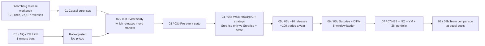
```mermaid
flowchart LR
    A[Bloomberg release workbook<br/>179 lines, 27,137 releases] --> B[01 Causal surprises]
    C[ES / NQ / YM / ZN<br/>1-minute bars] --> D[Roll-adjusted<br/>log prices]
    B --> E[02 / 02b Event study<br/>which releases move markets]
    D --> E
    E --> F[03 / 03b Pre-event state]
    F --> G[04 / 04b Walk-forward CPI strategy<br/>Surprise only vs Surprise + State]
    G --> H[05 / 05b ~10 releases<br/>~100 trades a year]
    H --> I[06 / 06b Surprise + DTW<br/>5-window ladder]
    I --> J[07 / 07b ES + NQ + YM + ZN portfolio]
    J --> K[08 / 08b Team comparison<br/>at equal costs]
```

---

## 2. The four markets

### 2.1 Why ES, NQ, YM and ZN

| | **ES** | **NQ** | **YM** | **ZN** |
|---|---|---|---|---|
| Underlying | S&P 500 index | Nasdaq-100 index | Dow Jones Industrial Average | 10-year US Treasury note |
| Exchange | CME | CME | CBOT | CBOT |
| Tick size | 0.25 index points | 0.25 index points | 1 index point | 1/64 of a point |
| Value per point | \$50 | \$20 | \$5 | \$1,000 |
| Value of one tick | \$12.50 | \$5.00 | \$5.00 | \$15.625 |
| Typical price (2019–2026) | 2,500–6,500 | 7,000–30,000 | ~18,000–48,000 | 105–135 |
| What moves it on a macro release | Growth, inflation, discount rates | Same as ES, more rate-sensitive (long-duration tech) | Same as ES, more industrials and banks, less tech | Expected policy rates and inflation |
| Round-trip cost used (2 ticks + \$4.50) | **≈ 1.7 bps** | **≈ 0.7–0.8 bps** | **≈ 1.0 bps** | **≈ 3.0 bps** |

ES is the most liquid equity-index future in the world and the project's main market. NQ is a second equity index with a higher share of long-duration technology stocks, so it should react **more** to inflation and rate news. YM, the E-mini Dow, holds fewer technology and more industrial and financial stocks than the S&P 500, so it tests whether the ES result carries over to a different mix of the same market; it was added after the ES, NQ and ZN results were known, as an out-of-sample market. ZN is a bond future: its price moves **opposite** to yields, so a hot inflation print or a strong jobs report should push ZN **down**. Together the four markets test whether the macro-surprise effect is a property of one contract, of equity indices, or of rate-sensitive markets in general.

### 2.2 The markets over the sample

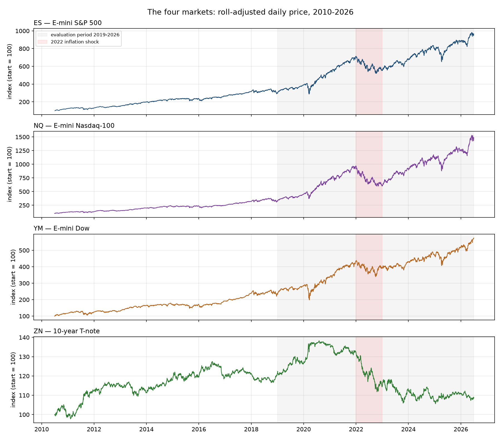

*Figure 1. Roll-adjusted daily prices of ES, NQ, YM and ZN, 2010–2026, rebased to 100. Grey: the walk-forward evaluation period (2019–2026). Red: the 2022 inflation shock.*

The evaluation period covers very different regimes: the low-inflation years 2019–2020, the COVID crash (March 2020), the 2022 inflation shock and the fastest Fed tightening in forty years, and the disinflation of 2023–2026. Over 2019–2026, buying and holding one contract returned:

| Buy and hold, 2019–2026 | ES | NQ | YM | ZN |
|---|---|---|---|---|
| Total return | +218% | +348% | +141% | −10.5% |
| Daily Sharpe | 0.90 | 0.99 | 0.78 | −0.23 |
| Maximum drawdown | −29.5% | −38.3% | −32.2% | −23.6% |

The strategies in this study hold positions for 30 minutes after a release, about 0.1–2% of the time, so they are **market-neutral** by construction (beta to buy-and-hold between −0.004 and +0.006 in every notebook). Buy-and-hold is shown only as a reference point.

### 2.3 What a release does to each market

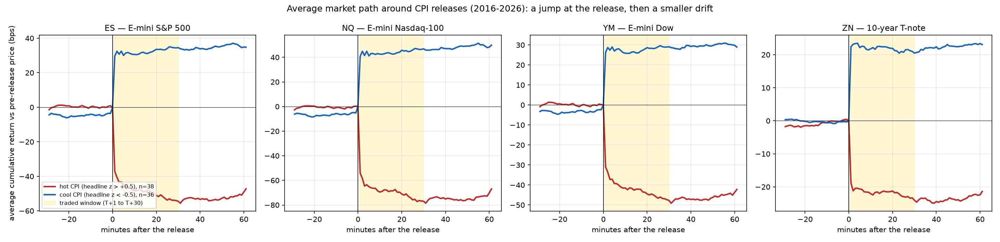

*Figure 2. Average cumulative return around CPI releases, 2016–2026, relative to the last pre-release price, split into hot prints (headline surprise above +0.5 SD) and cool prints (below −0.5 SD). Yellow: the window a strategy can trade (T+1 to T+30 minutes).*

Figure 2 summarises the whole project in one picture:

- **The jump.** At the release (minute 0) prices jump in the direction theory predicts. After a hot CPI print (38 releases with a headline surprise above +0.5 SD), ES falls about **37 bps**, NQ about **55 bps**, YM about **31 bps** and ZN about **19 bps** within the first minute. After a cool print (36 releases below −0.5 SD) they rise by about 30, 42 and 23 bps.
- **The drift.** In the equity indices the price keeps moving after the jump. After hot prints ES falls a further **~15–18 bps** (to about −55 bps at T+30) and NQ a further **~20 bps** (to about −77 bps). After cool prints the continuation is smaller (about +4 bps in both). YM looks like a slightly smaller ES: after hot prints it drifts a further ~17 bps, after cool prints about +3 bps. This post-jump move is what a strategy that reacts one minute after the release can capture, and it is larger after bad news than after good news.
- **The difference between markets.** In ZN the continuation after the first minute is only about **4–5 bps** after hot prints and slightly **reverses** after cool prints. Relative to ZN's round-trip cost of about 3 bps, almost nothing is left to trade, which is why no ZN strategy survives costs (Sections 6.4–6.6).
- **Before the release** all four markets are flat on average: there is no systematic pre-positioning in the 30 minutes before CPI.

---

## 3. The two signal families: macro surprise and DTW

### 3.1 The macro surprise

For each release line $i$ (for example "CPI MoM") at release $t$, the raw surprise is

$$s_{i,t} = A_{i,t} - F_{i,t},$$

where $A$ is the actual value and $F$ the Bloomberg survey median. Raw surprises are not comparable across lines (payrolls are in thousands of jobs, CPI in tenths of a percent), so each is standardised **causally**, using only earlier releases of the same line:

$$z_{i,t} = \frac{s_{i,t}}{\mathrm{sd}\left(s_{i,1}, \dots, s_{i,t-1}\right)}, \qquad \text{at least 24 previous releases}, \qquad z \text{ capped at } \pm 5.$$

A line's **sign** is estimated from history: a regression of the **instant jump** (the first-minute return) on $z$ over earlier years tells whether a positive surprise has pushed that market up or down. Lines published at the same instant (for example the eight CPI lines) are grouped into a **release family**, and the family signal is

$$x_{f,t} = \mathrm{mean}_{i \in f}\left(\text{sign}_i \times z_{i,t}\right),$$

so that $x > 0$ always means **good news for that market**. For ZN, "good news" means good for bond prices: a strong payrolls print is bad news for ZN but good news for ES.

**Economic channel.** A hot CPI print raises expected inflation and the expected path of the policy rate. Higher expected rates lower the present value of future earnings (bad for ES and especially NQ) and raise yields (bad for ZN). Strong payrolls raise expected growth (good for equities) but also expected rates (bad for bonds).

### 3.2 The DTW price pattern

Dynamic Time Warping measures the similarity between two time series that may be locally stretched or compressed in time. The team's DTW strategy (Jack Duncan, Hoshea Zeng) uses it to answer: *"Have we seen a price reaction like this one before, and what happened next?"* The specification used here follows the peer strategy exactly:

| Step | Specification |
|---|---|
| Query path | Log prices over the **31 minutes ending at the entry** (T−30 to T+1), z-scored so that only the *shape* matters |
| Library | Every earlier release at the **same clock time** (for example 08:30), last **3 years**, at most **600** most recent |
| Distance | DTW with a **Sakoe–Chiba band of 5 minutes** |
| Neighbours | The **k = 15** nearest paths, weighted by $1/\text{distance}$ × recency (2-year half-life) |
| Signal | **Direction** = weighted mean of the neighbours' next-30-minute returns; **dispersion** = weighted standard deviation |
| Gate | Trade only when the direction is outside the **middle 40%** of its own previous-3-year range |

A neighbour is used only if its own trade had already finished before the current release, so the signal is free of look-ahead. The code was validated on synthetic data in which the outcome depends on the path shape: it recovered the pattern with a rank IC of 0.52 and a 71% hit rate.

### 3.3 The pre-event state

Six **pre-registered** state variables describe the market just before the release, each with an economic hypothesis:

| State | Definition (known before T) | Hypothesis |
|---|---|---|
| `rv_20d` | 20-day realised volatility of daily closes | Higher uncertainty → larger reaction per unit of surprise |
| `rv_pre_1d` | Realised volatility of 5-minute returns over the last ~23 hours | Short-term stress amplifies the reaction |
| `mom_20d` | 20-day log return | After strong rallies, bad news hits harder |
| `dd_60d` | Distance from the 60-day high | In drawdowns the market is more sensitive to inflation |
| `overnight_ret` | Previous 16:00 close → T−1 | A large pre-release move means partial pre-positioning |
| `prev_x` | Previous surprise of the same release | Surprise streaks confirm a trend |

Each state is converted to a percentile against a **trailing one-year** distribution (for intraday states, measured at the same clock time), so no full-sample information is used.

### 3.4 How the signals are combined into trades

| Rule | Position |
|---|---|
| **Naive sign** | $\text{sign}(x)$, one contract, no estimation |
| **Surprise model** | $\hat b\,x$ with $\hat b$ re-estimated walk-forward; trade $\text{sign}(\hat b\,x)$ only if the absolute value of $\hat b\,x$ exceeds the round-trip cost |
| **Surprise + State** | $\hat r = a + b\,x + c\,s + d\,(x \times s)$, walk-forward |
| **State filter** | Surprise model, but skip the low-volatility tercile |
| **Adaptive state** | Each year, choose the state (or none) that worked best in the training data |
| **Signal × volatility** | Jack's sizing: position proportional to $x$ × recent volatility |
| **Surprise + DTW agree** | Trade the surprise only when DTW points the same way |
| **Surprise + DTW blend** | Average the two signs (opposite signs cancel) |
| **DTW only** | Sign of the DTW direction, after the gate |


---

## 4. Data

### 4.1 Sources

| Data | Source | Coverage | Used for |
|---|---|---|---|
| **Macro releases** | Bloomberg Economic Calendar workbook (`Bloomberg Economic Releases.xlsx`), 17 yearly sheets | 2010–2026: **179 release lines, 27,137 release rows** (release date and time, event name, survey median, actual, ticker) | Surprises, release calendar |
| **ES 1-minute bars** | Databento, continuous front-month `ES.c.0` with `instrument_id` | July 2010 – June 2026 | ES prices |
| **NQ and ZN 1-minute bars** | Jack Duncan's cleaned files `futures_1min_clean_v3_{NQ,ZN}.parquet` (team repo, `data/processed/`) | July 2010 – June 2026, 5.3–5.4 million bars each, 64 contract rolls | NQ and ZN prices |
| **YM 1-minute bars** | Databento `YM.c.0`, cleaned with the team pipeline into `futures_1min_clean_v3_YM.parquet` | July 2010 – June 2026, 5.2 million bars, 3,754 sessions, 64 contract rolls | YM prices |
| **Team outputs** (Notebook 08 only) | Hoshea Zeng's DTW factor file; Aaryen Mehta's walk-forward predictions (10, 30, 60 minutes) | 2012–2026 | Team comparison |

The raw data are proprietary (Bloomberg, Databento) and are **not** included in the repository (`.gitignore` excludes `*.parquet` and `*.xlsx`).

### 4.2 Samples

| Sample | Size | Period |
|---|---|---|
| Core event study (CPI, NFP, PCE) | **363 releases** (122 CPI, 122 NFP, 119 PCE); 354 with NQ prices, 348 with YM prices, 350 with ZN prices | 2016–2026 |
| Release families (lines grouped by timestamp) | 143 lines with ≥ 30 releases → **75 families** | 2013–2026 |
| Causal surprises | **17,328** with a z-score (≥ 24 prior releases); 0.47% capped at ±5σ | 2010–2026 |
| Release timestamps with a price path | ~6,100 since 2016 (~5,850 with a complete 30-minute trade return) | 2016–2026 |
| Walk-forward evaluation window | 2019-01 to 2026-06 (7.5 years); 2016–2018 used only as history | |

### 4.3 Data cleaning

- **Time zones.** Release times are Eastern Time and converted to UTC, with daylight-saving time handled explicitly; bars are in UTC.
- **Bar labels.** A 1-minute bar is labelled by its **start** minute: the bar labelled 08:30 covers 08:30:00–08:30:59 and closes at 08:31.
- **Contract rolls.** A continuous futures series jumps at each quarterly roll by the calendar spread (in NQ up to ±700 bps). Returns across a change of contract are set to zero, which leaves returns within each contract exactly unchanged (checked: maximum difference 0).
- **Duplicates and missing values.** Releases are de-duplicated by (line, timestamp), keeping the last revision. A price is used only if a bar exists within 5 minutes of the required time.

---

## 5. Methodology

### 5.1 Timing of a trade

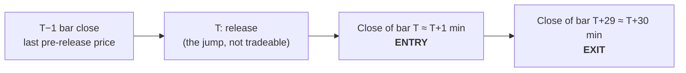
```mermaid
flowchart LR
    P["T−1 bar close<br/>last pre-release price"] --> J["T: release<br/>(the jump, not tradeable)"]
    J --> E["Close of bar T ≈ T+1 min<br/><b>ENTRY</b>"]
    E --> X["Close of bar T+29 ≈ T+30 min<br/><b>EXIT</b>"]
```

For a release at time $T$:

| Quantity | Definition | Used in |
|---|---|---|
| **Reaction** over $h$ minutes | $R_{T,h} = \ln P_{T+h-1} - \ln P_{T-1}$ (includes the jump) | Notebooks 02, 02b, 03 |
| **Jump** | $\ln P_{T} - \ln P_{T-1}$ (close of the release bar vs the last pre-release close) | Line signs, impact screen |
| **Drift / trade return** | $D_{T,h} = \ln P_{T+h-1} - \ln P_{T}$ (entry about one minute after the release) | Every strategy |

Because log returns add, $R_{T,h} = R_{T,1} + D_{T,h}$, an identity checked in every notebook. **Every strategy in this study enters at the close of the first post-release bar.** This is the single most important design choice: Section 6.8 shows that an entry at the pre-release price multiplies a strategy's apparent Sharpe by two.

### 5.2 The event-study regressions (Notebooks 02, 02b)

For each release family and horizon:

$$R_{T,h} = \alpha + \sum_k \beta_k\, z_{k,T} + \varepsilon_T,$$

with the Notebook 02 components (CPI: headline and core; NFP: payrolls, unemployment rate, average hourly earnings; PCE: headline and core) and **HC3** heteroskedasticity-robust standard errors.

### 5.3 State interaction tests (Notebooks 03, 03b)

$$r_T = a + b\,x_T + c\,s_T + d\,(x_T \times s_T) + \varepsilon_T,$$

where $s_T$ is a state percentile in $[0,1]$. Because $x$ is signed so that $b > 0$, a positive $d$ means **a stronger reaction in the high state**, and $d$ is the change in the surprise beta from the lowest to the highest state. Each interaction is tested four ways, all **pre-registered**:

1. HC3 t-test and a **2,000-draw permutation test** (shuffling the state across events);
2. **Benjamini–Hochberg FDR** correction across the 48 primary tests (q < 0.10);
3. **Subperiod stability**: the same sign in 2016–2020 and 2021–2026;
4. **Horizon consistency**: the same sign across most of the 9 horizons.

A (state, family) pair is carried into Notebook 04 only if it passes all four.

### 5.4 Walk-forward backtest (Notebooks 04–08)

- **Estimation.** Every coefficient, sign, screen and gate is estimated using only releases **before** the one being traded. The first 36 releases of a family are training only.
- **Evaluation.** 2019-01 to 2026-06, the same for every notebook and market.
- **Positions.** One contract per trade (or a fraction, for the volatility-sized books), held for 30 minutes.
- **Costs.** Base case: **2 ticks of slippage (1 per side) + \$4.50 commission per round trip**, converted to bps with the pre-release price:
  $$\text{cost}_{\text{bps}} = \frac{2 \times \text{tick} + 4.50 / \text{point value}}{P_{T-1}} \times 10^4.$$
  Sensitivities run from 0 to 8 ticks, and Notebook 08 also uses the peer assumption of ¼ tick per side.
- **Sharpe ratio.** Monthly net returns (months without trades count as zero) × √12. The peer-format tables use daily returns × √252, as on the team's slides.

### 5.5 Statistical safeguards

| Risk | Safeguard |
|---|---|
| Look-ahead bias | Causal z-scores, trailing percentiles, walk-forward estimation, explicit checks (asof < T, pre-close matches) |
| Multiple testing | Pre-registered states and targets, BH-FDR, permutation tests |
| Luck in the direction | **Random-sign test**: 1,000 books with the same trades and costs but random directions; p = share with a Sharpe at least as high |
| Uncertain Sharpe | Moving-block bootstrap (3-month blocks) of the monthly Sharpe; paired bootstrap of Sharpe differences |
| Regime dependence | Sharpe excluding 2022; 2019–2021 vs 2022–2026 |
| Execution | Cost sensitivity; entry delays of 1, 2 and 5 minutes; holding periods of 5–60 minutes |
| Code errors | Cross-notebook equality checks (every notebook reproduces the previous one's trade returns to < 10⁻¹³ bps); DTW validation on synthetic data |

### 5.6 Release universe (Notebooks 05–07)

To trade more than CPI, an **impact screen** (Jack Duncan's method) ranks release families each year using only history:

$$\text{impact}_f = \frac{\text{mean}\left|\text{30-min reaction}\right| \text{ on family } f\text{'s releases}}{\text{mean}\left|\text{30-min reaction}\right| \text{ at the same clock time on other families' releases}}.$$

The **top 10 families** each year are traded (CPI is always included). This yields about 108 release timestamps a year.

### 5.7 Software

All analysis is in Python (numpy, pandas, matplotlib). HC3 regression, BH-FDR, the permutation and random-sign tests, the block bootstrap, and a vectorised DTW with a Sakoe–Chiba band are implemented in `src/` without external statistics libraries.

| Module | Content |
|---|---|
| `src/state_conditioning.py` | Loading and roll-adjusting minute bars, daily closes, state features, HC3 OLS, interaction and magnitude tests, BH-FDR |
| `src/walk_forward.py` | Strategy specifications, walk-forward engine, costs, performance metrics, bootstrap, peer-format daily metrics |
| `src/surprise_universe.py` | Bloomberg loader, release families, causal surprises, price measures, impact screen, line signs, positions |
| `src/dtw_signal.py` | Price paths, vectorised DTW, walk-forward DTW signal, rank gate, five-window ladder |
| `src/multi_asset.py` | ES/NQ/YM/ZN contract specs, the full Notebook 05+06 pipeline per market, portfolio weights |
| `src/team_replication.py` | Rebuild of Jack Duncan's DTW ladder from its published specification (Notebook 08) |


---

## 6. Results, notebook by notebook

Each subsection follows the same structure: **question → design → results → interpretation**. ES results come first; NQ, YM and ZN (the "b" notebooks, which run identical code on the other markets) follow. The YM notebooks are `02b_event_response_YM`, `03b–06b_*_YM`, `07b_multi_market_with_YM` and `08b_team_comparison_with_YM`; each saves its outputs with the `nb0Xb_YM_` prefix and ends with a conclusion file in `results/` (for example `nb05b_YM_conclusion.md`).

### 6.1 Notebook 01: building causal macro surprises

**Question.** Can the Bloomberg release workbook be turned into a clean, comparable, look-ahead-free surprise for every release?

**Design.** The 17 yearly sheets are stacked into one table of (ticker, release time, event name, survey median, actual). Release times are converted from ET to UTC. For the core event study, one row is built per release of CPI, the Employment Report (NFP) and PCE, with a standardised surprise for each component (headline CPI, core CPI; payrolls, unemployment rate, average hourly earnings; headline PCE, core PCE).

**Result.** A panel of **363 releases** (2016–2026) with standardised surprises for seven components, saved as `data/processed/macro_event_model_data_2016_2026.parquet` and used by every later notebook. Notebook 05 extends the same logic to all 179 lines (17,328 causal surprises, 75 release families).

---

### 6.2 Notebooks 02 and 02b: which releases move which market?

**Question (RQ1).** Which releases move the market, how much, and how much of the move is explained by the surprise?

**Design.** Event study of the 363 CPI, NFP and PCE releases: the reaction from the last pre-release price to 1, 5, 15, 30 and 60 minutes after the release, regressed on the surprise components with HC3 errors. Notebook 02 covers ES; Notebook 02b repeats it for NQ and ZN with ES as the reference, and adds the **tradeable drift** from T+1; `02b_event_response_YM` does the same for YM.

#### 6.2.1 ES (Notebook 02)

| Release | Mean \|reaction\| at 30 min (bps) | R² at 1 min | R² at 5 min | R² at 30 min | Headline beta, 5 min (bps per 1 SD) |
|---|---|---|---|---|---|
| **CPI** | **38.5** | **0.30** | **0.27** | **0.25** | **−20.8** (t = −3.1) |
| NFP | 29.6 | 0.03 | 0.03 | 0.04 | +2.8 (payrolls, not significant) |
| PCE | 14.7 | 0.14 | 0.10 | 0.03 | −3.8 |

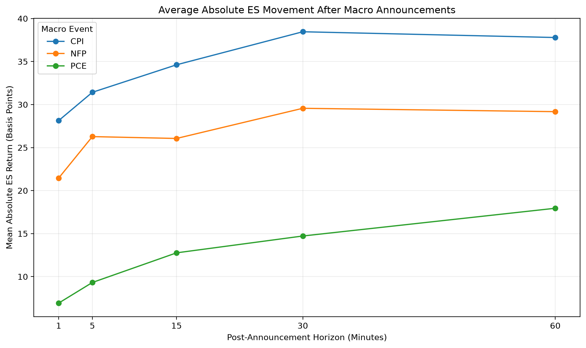

*Figure 3. Mean absolute ES reaction by release and horizon.*

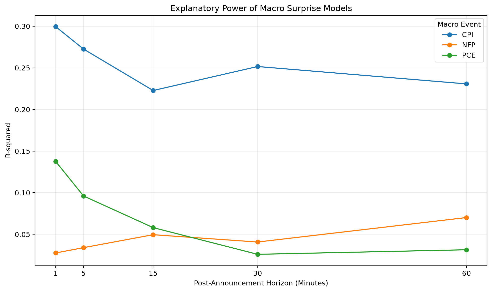

*Figure 4. How much of the ES reaction the surprise explains (R²), by release and horizon.*

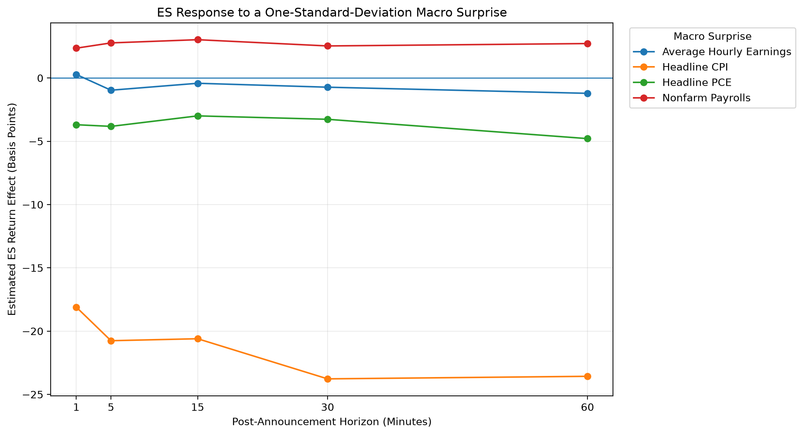

*Figure 5. Surprise coefficients (bps per 1-SD surprise) and their significance.*

The headline CPI coefficient is **−18 to −24 bps per 1-SD surprise** at every horizon from 1 to 60 minutes, all significant at 1%. NFP moves ES almost as much as CPI (30 bps on average) but in a direction the surprise hardly explains (R² 3–7%), because payrolls, unemployment and wages often point in different directions and the market weighs growth against rates. The only other significant effect at 5% is average hourly earnings at 60 minutes (−1.2 bps).

| Release | Main signal | Typical ES response | Impact rank | Directional rank | R² range | Strength |
|---|---|---|---|---|---|---|
| **CPI** | Headline CPI | Hotter inflation → ES lower | 1 | 1 | 22–30% | **Strong** |
| NFP | Payrolls / wages | Strong payrolls → modestly higher; hot wages → lower | 2 | 3 | 3–7% | Weak / mixed |
| PCE | Headline PCE | Hotter inflation → ES lower | 3 | 2 | 3–14% | Moderate at short horizons |

#### 6.2.2 NQ, YM and ZN (Notebook 02b)

| Market | Release | Mean \|30-min reaction\| (bps) | Headline beta, 5 min | t | R², 5 min | Drift beta T+1→T+30 | t |
|---|---|---|---|---|---|---|---|
| ES | **CPI** | 38.5 | **−20.8** | −2.8 | **0.27** | −5.7 | −1.4 |
| NQ | **CPI** | **53.6** | **−27.7** | −2.7 | **0.30** | −4.6 | −0.9 |
| YM | **CPI** | 33.2 | **−19.2** | −2.8 | **0.27** | −5.3 | −1.4 |
| ZN | **CPI** | 22.5 | **−9.9** | −2.8 | **0.30** | −0.06 | −0.04 |
| ES | NFP | 29.6 | +2.8 | 1.0 | 0.03 | +0.2 | 0.1 |
| NQ | NFP | 36.0 | +2.5 | 1.0 | 0.01 | −0.6 | −0.4 |
| YM | NFP | 27.9 | +2.8 | 1.1 | 0.07 | +0.6 | 0.4 |
| ZN | NFP | 23.6 | −1.5 | −0.8 | 0.03 | +0.1 | 0.1 |
| ES | PCE | 14.9 | −3.8 | −1.8 | 0.10 | +0.4 | 0.2 |
| NQ | PCE | 18.5 | −5.2 | −2.0 | 0.10 | +1.3 | 0.5 |
| YM | PCE | 11.9 | −2.9 | −1.7 | 0.09 | −0.6 | −0.4 |
| ZN | PCE | 8.3 | −0.9 | −1.0 | 0.04 | +0.5 | 0.5 |

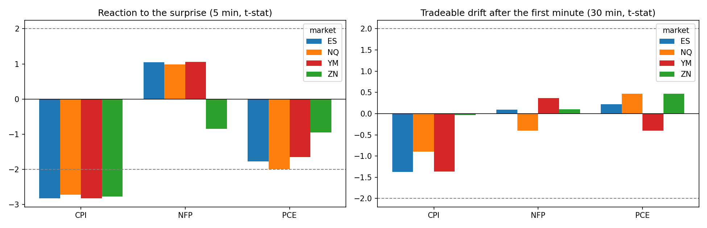

*Figure 6. Reaction (from the pre-release price) vs tradeable drift (from T+1) for the four markets.*

**Interpretation.**

- **CPI is the valuable release in all four markets.** It explains 27–30% of the five-minute reaction everywhere, with the economically expected sign: a hot print lowers equities and bond prices.
- **NQ reacts about 35% more than ES** (−27.7 vs −20.8 bps per SD), consistent with the higher rate sensitivity of long-duration technology stocks.
- **YM behaves like a slightly smaller ES:** about 92% of ES's CPI response (−19.2 vs −20.8 bps per SD), the same R², and almost the same drift coefficient (−5.3 vs −5.7). NFP explains more of YM's move (R² 0.07–0.14) than of ES's or NQ's, consistent with the Dow's tilt to industrials and banks, but no single NFP component is significant.
- **ZN reacts in bps about half as much as ES,** but a ZN bp is a larger move in yield terms; its R² is as high as ES's.
- **The drift is the problem.** Measured from T+1 with the multivariate specification, the 30-minute drift is −5.7 bps per SD in ES, −4.6 in NQ, −5.3 in YM and essentially **zero in ZN**. None is individually significant with 120 CPI releases, which is why the trading tests in Notebooks 04–05 (which aggregate many releases and use walk-forward signs) are the decisive evidence.

---

### 6.3 Notebooks 03 and 03b: does the pre-event state matter?

**Question (RQ2, RQ3).** Does the same surprise have a different effect depending on the market's state before the release? And how much of the reaction is tradeable?

**Design.** Six pre-registered states (Section 3.3), two pre-registered targets (the 5-minute reaction `ret_5m` and the 30-minute tradeable drift `drift_30m`), bucket betas by tercile, interaction regressions, permutation tests, BH-FDR, subperiod stability, magnitude regressions, and a four-criterion selection rule (Section 5.3).

#### 6.3.1 The surprise signal and the tradeable part

| | ES | NQ | YM | ZN |
|---|---|---|---|---|
| corr(x, 5-min return), CPI | 0.51 | 0.54 | 0.51 | 0.53 |
| corr(x, 5-min return), PCE | 0.31 | 0.32 | 0.30 | 0.19 |
| corr(x, 5-min return), NFP | 0.13 | 0.03 | 0.22 | 0.16 (sign reversed for bonds) |
| CPI: mean \|30-min drift\| (bps) | ~20 | 26.3 | 18.3 | 10.5 |
| CPI: 5-min reaction per 1-SD surprise (bps) | 26.7 | 36.9 | 22.2 | 14.2 |
| CPI: **30-min drift per 1-SD surprise (bps)** | **5.9** | **8.5** | **4.4** | **0.8** |

The surprise signal is correctly signed in every market. In ES, NQ and YM roughly a fifth to a quarter of the CPI reaction remains as a drift after the first minute; in ZN almost none does. This one line explains most of the trading results that follow.

#### 6.3.2 The market's daily state

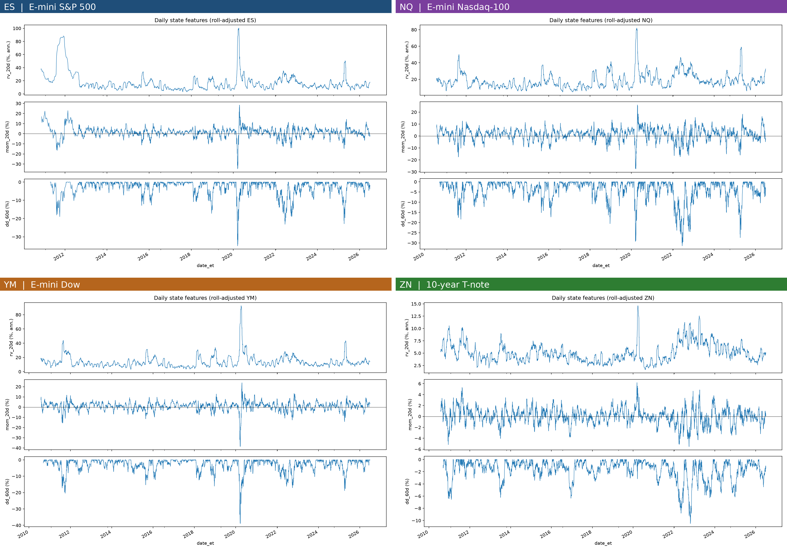

*Figure 7. Daily state features of ES, NQ, YM and ZN, 2010–2026: 20-day realised volatility (annualised %), 20-day momentum (%) and distance from the 60-day high (%). All three are computed from roll-adjusted daily closes.*

**Reading Figure 7 across markets.** The two equity indices share the same history of stress. Volatility spikes in 2011, late 2015, 2018, **March 2020** (the largest: about 100% annualised in ES and about 80% in NQ), through 2022 (NQ stays above 30–40% for most of the year) and again in **April 2025**, and every spike coincides with a deep drawdown and a sharp fall in momentum. NQ's levels are higher than ES's throughout (median volatility about 16% vs 13%), and its 2022 drawdown (about −30%) is much deeper than ES's, because long-duration technology stocks were hit hardest by rising rates. ZN lives on a different scale: its volatility is usually 3–8% and peaks at about 15% in March 2020, and its drawdowns come from **rising yields** (2013 taper tantrum, late 2016, and the 2022 tightening, when it reached −10.5%), not from equity crashes. In March 2020 ZN's momentum turned sharply positive while equities collapsed: bonds rallied as a safe haven. This is why the equity states behave as one "stress regime" and the bond states do not. YM follows ES closely, with slightly lower volatility (median about 11.8%, peak about 93% in March 2020) and a deepest 60-day drawdown of about −39%. (The ES volatility spike in 2011 is overstated by gaps in the original vendor file; the cleaned file used for trading does not have them.)

| Daily state | ES | NQ | YM | ZN |
|---|---|---|---|---|
| 20-day realised vol, median | ~13% | ~16% | ~11.8% | ~4.7% |
| 20-day realised vol, maximum | ~100% (March 2020) | ~82% | ~93% | ~15% |
| Deepest 60-day drawdown | −35% | −31% | −39% | −10.5% |
| Spearman corr(vol, drawdown) at events | −0.6 to −0.8 | −0.67 to −0.75 | see `nb03b_YM_state_correlation.png` | −0.15 to −0.21 |

In the equity markets volatility, momentum and drawdown move together as one "stress regime"; in ZN they are largely separate.

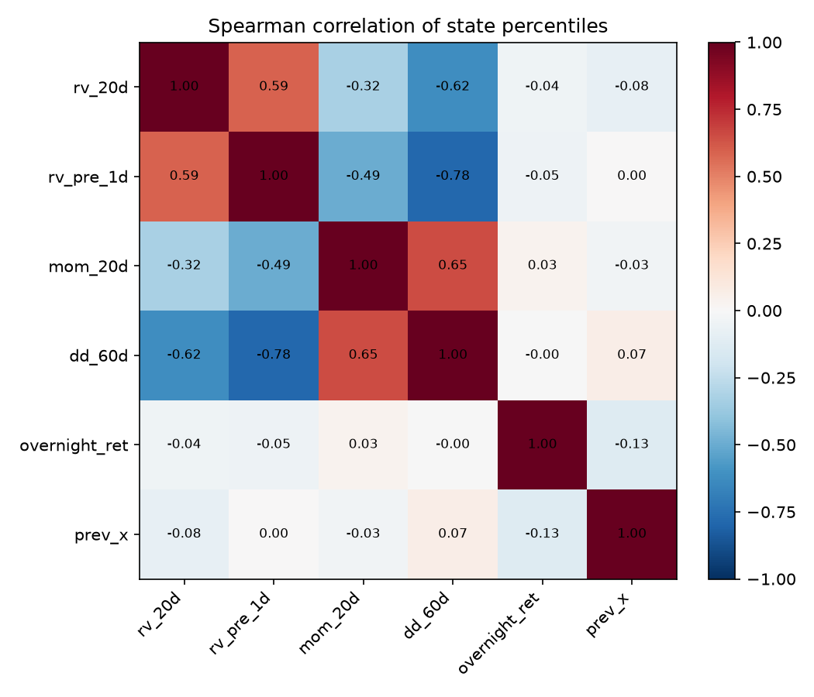

*Figure 8. Spearman correlation between the six pre-registered state percentiles (ES).*

#### 6.3.3 Bucket betas: CPI response by state tercile

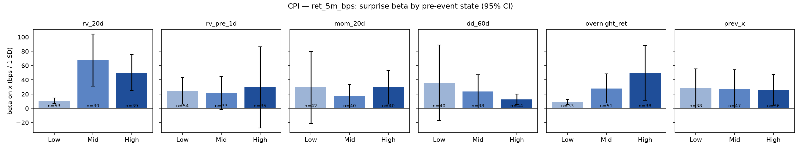

*Figure 9. ES: CPI surprise beta on the 5-minute reaction, by tercile of each state.*

| CPI beta on the 5-min reaction (bps per 1-SD good-news surprise) | Low | Mid | High |
|---|---|---|---|
| ES · 20-day volatility | 11 | 50–68 | 50–68 |
| NQ · 20-day volatility | 18 | 70 | 58 |
| YM · 20-day volatility | 8 | 43 | 52 |
| ZN · 20-day volatility | 15 | 12 | 19 |
| ES · overnight return | 9 | 28 | 50 |
| NQ · overnight return | 16 | 28 | 76 |
| YM · overnight return | 6 | 31 | 40 |
| ZN · overnight return | 9 | 14 | 18 |

In **ES, NQ and YM, CPI hits much harder when volatility is elevated**, and the response rises monotonically with the overnight move. In ZN there is no volatility pattern; only the overnight pattern repeats.

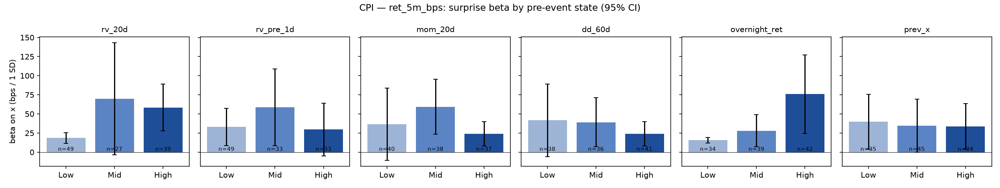

*Figure 10. NQ: CPI surprise beta by state tercile.*

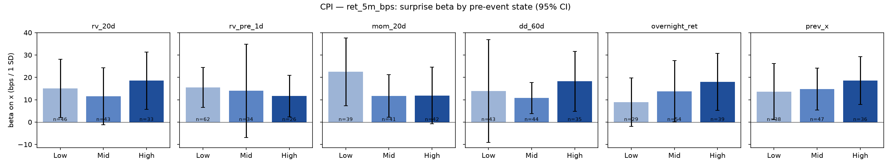

*Figure 11. ZN: CPI surprise beta by state tercile.*

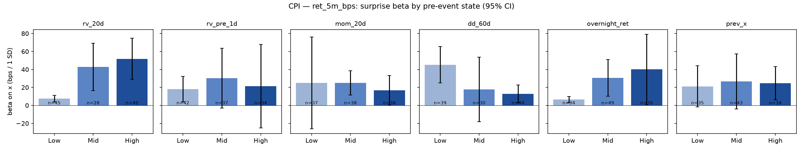

*Figure 11b. YM: CPI surprise beta by state tercile.*

#### 6.3.4 Interaction tests, multiple testing and stability

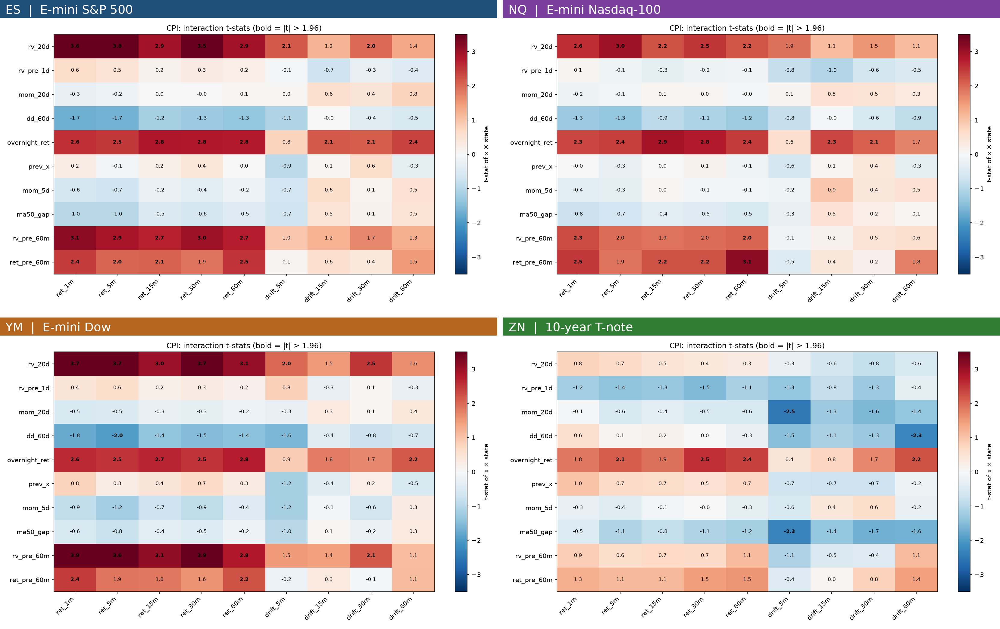

*Figure 12. t-statistics of the CPI × state interaction $d$ for ES, NQ, YM and ZN, across the ten states (rows) and nine targets (columns: the 1–60 minute reactions and the 5–60 minute drifts). Red: the state strengthens the CPI response; blue: it weakens it. A credible effect is a row of same-coloured cells; a single bold cell among about 90 is what chance produces.*

**Reading Figure 12 across markets.** In **ES** the `rv_20d` row is dark red on every reaction horizon (t = 2.9–3.8 from 1 to 60 minutes) but much lighter on the drift columns (t = 1.2–2.1): volatility mainly amplifies the **first-minute jump**. The `overnight_ret` row is red on both reactions and drifts (t ≈ 2.1–2.8), and the exploratory 60-minute pre-release volatility and return rows repeat the same message. **NQ** shows the same red rows, slightly weaker (`rv_20d` t = 2.2–3.0 on the reactions, 1.1–1.9 on the drifts; `overnight_ret` up to 2.9), which is strong evidence that the ES pattern is not a fluke of one contract. **YM**, added later as an out-of-sample market, repeats it almost exactly (`rv_20d` × CPI on the 5-minute reaction t = 3.7, +59 bps). **ZN** looks different: the `rv_20d` row is pale (|t| < 1), `overnight_ret` is the only red row (t ≈ 1.8–2.5), and the drift columns are mostly blue for momentum, distance from the 50-day average and drawdown: in bonds, a strong recent trend weakens the post-release drift rather than strengthening it. The significant ZN state effect (`rv_pre_1d`) appears only when all releases are pooled; for CPI alone its row is mildly blue (t between −0.4 and −1.5).

| | ES | NQ | YM | ZN |
|---|---|---|---|---|
| Strongest primary interaction | CPI × `rv_20d` on `ret_5m`, **t = 3.8** (+61 bps from calmest to most volatile) | CPI × `rv_20d` on `ret_5m`, **t = 3.0** (+58 bps) | CPI × `rv_20d` on `ret_5m`, **t = 3.7** (+59 bps) | `rv_pre_1d` × all releases on `drift_30m`, **t = −3.2** (−4.6 bps) |
| Other notable | NFP × vol, t = −3.0 | CPI × overnight, t = 2.4 | NFP × vol, t ≈ −3.1; CPI × `rv_20d` on the drift, t = 2.5 | CPI × overnight, t = 2.1 |
| Tests significant at 5% (expected by chance: 2.4 of 48) | 7 | 3 (4 by permutation) | 10 (8 by permutation) | 3 (3 by permutation) |
| **Survive BH-FDR (q < 0.10)** | **2** | **0** | **3** | **1** |
| Stable in both subperiods? | CPI × vol: same sign, significant only after 2021 | Same as ES | CPI × vol: same sign, stronger after 2021; NFP × vol: 2016–2020 only | **Yes**: t = −2.9 before 2021, −2.2 after |
| **Selected for Notebook 04** | `rv_20d` × CPI, `rv_20d` × NFP | **none** | `rv_20d` × CPI (NFP × vol not stable) | `rv_pre_1d` × all releases |

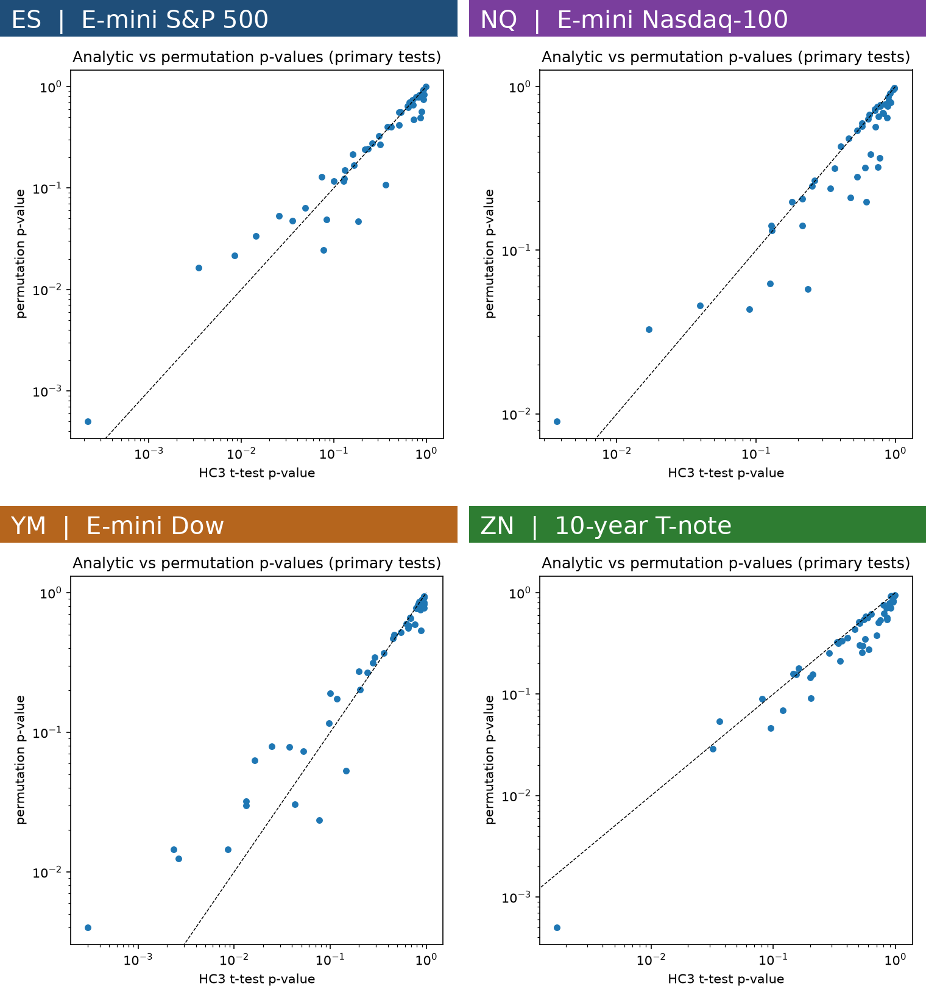

*Figure 13. Analytic (HC3 t-test) p-values against permutation p-values (2,000 shuffles of the state across events) for the 48 primary interaction tests, on log scales, for ES, NQ, YM and ZN. The dashed line is the 45° line; points in the lower-left corner are the significant tests.*

**Reading Figure 13 across markets.** In all four markets the points lie close to the 45° line, so the analytic HC3 tests agree with a test that makes no distributional assumption: fat tails and outlying releases do not drive the results. What differs is how many points reach the lower-left corner: **7 below 5% in ES** (2.4 expected by chance), with one test at p ≈ 0.0005 in both methods; **3–4 in NQ**, the strongest at about 0.004–0.009; **10 in YM** (8 by permutation), and **3 in ZN**, with one very strong test (p ≈ 0.002 analytic, 0.0005 permutation). Only ES has clearly more significant results than chance, which is why two ES tests survive the FDR correction, none in NQ and one in ZN (the pooled `rv_pre_1d` effect). YM, with three survivors, is as strong as ES.

#### 6.3.5 The state predicts the size of the move

| Magnitude tests surviving FDR (of 360) | ES | NQ | YM | ZN |
|---|---|---|---|---|
| Count | **198** | **154** | **156** | **0** |
| Example | High `rv_20d`: absolute move ~20 bps larger (t ≈ 4–5) | High `rv_20d`: 30-min drift ~18 bps larger (t = 4.2); deep drawdown ~23 bps larger (t = −4.8) | Previous-day vol on the 30-min drift, t = 5.2; drawdown, t = −5.0 | Best: previous surprise × PCE, q = 0.10 |

**Interpretation of Section 6.3.**

- The pre-event state **matters for the size** of equity-index moves: in stressed markets everything moves more. This is the most robust result of the notebook in ES, NQ and YM, and it is useful for **risk sizing**, not direction.
- The state **also changes the CPI surprise beta** in ES, NQ and YM (about +60 bps from calm to volatile markets), but mainly on the **untradeable 5-minute reaction**, mainly **after 2021**, and in NQ not strongly enough to survive multiple-testing correction.
- In ZN the only robust state effect is **negative and small**: after a volatile day, the post-release drift follows the surprise less. It is the only state effect in the whole study that is significant in both subperiods, but at −4.6 bps across the full range it is economically too small to trade.


---

### 6.4 Notebooks 04 and 04b: can the reaction be traded in real time?

**Question (RQ4).** Could a trader have made money from CPI surprises in real time, after costs, using only information available at each release? And does conditioning on the pre-event state improve the strategy out of sample?

**Design.** Entry at the close of the first post-release bar, exit 30 minutes after the release. Five strategies (Section 3.4: naive sign, surprise only, surprise + state, state filter, adaptive state), re-estimated walk-forward. Universes: CPI; CPI + PCE; CPI + PCE + NFP. Evaluation 2019–2026, costs 2 ticks + \$4.50. The state models use `rv_20d` (the ES selection) in all four markets.

#### 6.4.1 Main result: CPI, net of costs

| CPI, 2019–2026 | ES | NQ | YM | ZN |
|---|---|---|---|---|
| Average round-trip cost | 1.7 bps | 0.7 bps | 0.8–1.0 bps | 3.0 bps |
| **Naive sign**: trades / net bps per trade / **Sharpe** | 86 / 9.8 / **1.03** | 79 / 13.6 / **1.00** | 77 / 8.9 / **0.99** | 86 / −0.3 / −0.05 (gross **0.53**) |
| **Surprise only**: trades / net bps / **Sharpe** | 52 / 12.8 / **0.99** | 62 / 12.1 / **0.79** | 48 / 10.4 / **0.84** | 2 / −3.2 / −0.51 |
| Surprise + State | 51 / 10.4 / 0.77 | 64 / 11.2 / 0.75 | 51 / 9.6 / 0.83 | 5 / −3.6 / −0.40 |
| State filter | 28 / 23.0 / 1.07 | 36 / 19.9 / 0.82 | 28 / 18.4 / 0.98 | 1 / −3.9 / −0.37 |
| Adaptive state | 49 / 12.7 / 0.95 | 64 / 11.2 / 0.75 | 53 / 8.3 / 0.74 | 2 / −3.2 / −0.51 |
| Surprise only: 90% bootstrap CI of Sharpe | 0.25 to 1.72 | 0.12 to 1.47 | 0.07 to 1.61 | — |
| Surprise only: hit rate / t-stat of average trade | 64% / 2.8 | 58% / 2.2 | 58% / 2.4 | — |

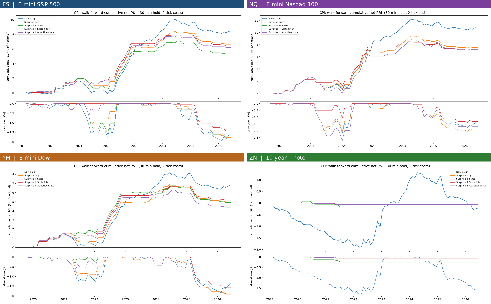

*Figures 14–16. Walk-forward cumulative net P&L of the CPI strategies (top of each panel) and drawdowns (bottom), for ES, NQ, YM and ZN. In ZN the fitted models almost never trade because the predicted move rarely exceeds the cost. The single-market versions are `nb04_cum_pnl_CPI.png` and `nb04b_{NQ,YM,ZN}_cum_pnl_CPI.png`.*

**Interpretation.**

- **ES, NQ and YM: yes, CPI surprises are tradeable.** A net Sharpe of about 1.0 in ES, 0.8–1.0 in NQ and 0.84–0.99 in YM, statistically positive, with 6–11 trades a year. In YM every CPI strategy has a 90% bootstrap interval above zero.
- **The naive sign rule is as good as or better than the fitted model.** In ES the two are equal; in NQ the naive rule is *significantly* better (Sharpe +0.21, P(not better) = 0.04), because with costs below 1 bps it pays to trade every CPI release rather than wait for a large predicted move. YM, with costs of about 1 bps, ranks the rules the same way (naive 0.99, surprise only 0.84). The edge comes from the **economic direction** of the surprise, not from estimating a model.
- **ZN: no.** The naive CPI rule makes +2.7 bps per trade before costs (gross Sharpe 0.53), about the same as the 3 bps cost. The fitted models correctly refuse to trade.

#### 6.4.2 When could a trader have known about the state effect?

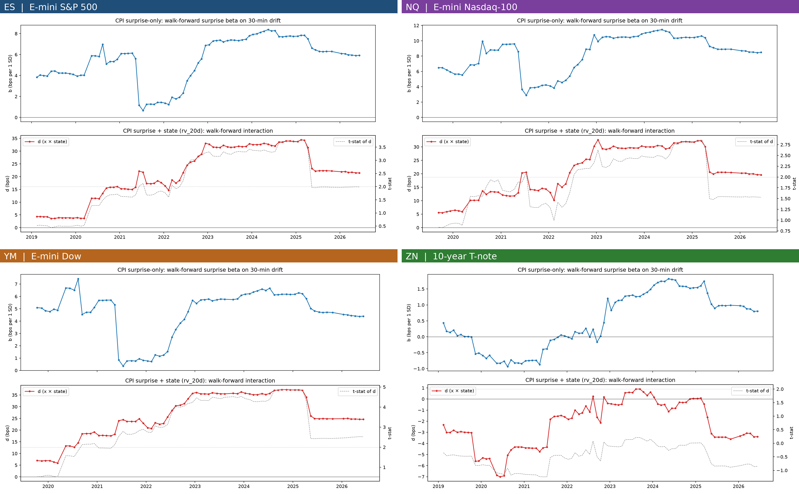

*Figure 17. Walk-forward estimates at each CPI release of the surprise beta $\hat b_t$ and the state interaction $\hat d_t$ with its t-statistic, for ES, NQ, YM and ZN. Each point uses only earlier releases.*

**Reading Figure 17 across markets.** In **ES** the CPI beta on the 30-minute drift starts at about 4 bps per 1-SD in 2019, **collapses to about 1 bp in mid-2021** (when inflation surprises first appeared and the market's reaction was confused), then climbs steadily through 2022 to about **8 bps in 2023–2024** before easing to 6 bps. The interaction $\hat d_t$ rises from about 4 bps (t ≈ 0.5) in 2019 to about 33 bps (t ≈ 3.5) from 2023, and its t-statistic first crosses 2 only in mid-2022; after a sharp drop in 2025 it stays at about t = 2. **NQ** follows exactly the same shape at a higher level (beta 6 → 3 in 2021 → 10–11 in 2023–2024 → 8.5; the interaction's t-statistic peaks at about 2.8 in 2024–2025 and falls to 1.5). **YM** has the same shape again: the beta falls from about 5–7 bps to below 1 bp in mid-2021, recovers to about 6 bps from 2023 and eases to about 4.4 bps; the interaction's t-statistic rises from 0.6 in 2019 to 4.2–4.9 in 2022–2024 and falls to about 2.5 in 2025–2026. In **ZN** the beta stays between −0.9 and +1.8 bps, positive only since late 2022, and the interaction is small and negative, with t between −1.2 and +0.2 throughout. For a trader in real time, the state effect was invisible until 2022 in all three equity markets and never existed in bonds.

The CPI × `rv_20d` interaction was **not detectable in real time before 2022**: its training t-stat was 0.5 in 2019 and 1.7–1.8 in 2020–2021, and reached 3.3 only in 2022 (ES). NQ shows the same pattern (0.9 → 1.4–1.9 → 2.3–2.8 in 2022–2024 → 1.5 in 2025–2026). The effect that Notebook 03 finds on the full sample could not have been used by a trader in 2019–2021.

#### 6.4.3 Where do profits come from?

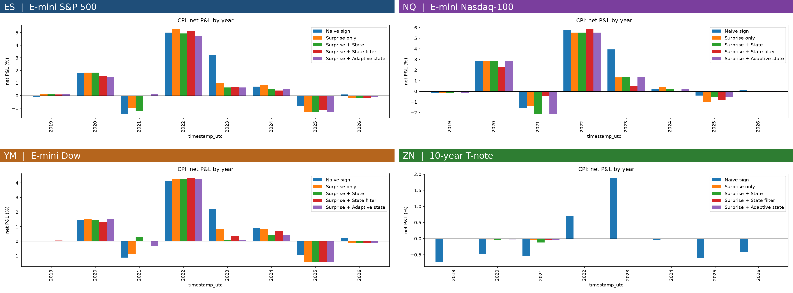

*Figure 18. CPI net P&L by calendar year (% of notional) for the five strategies, ES, NQ, YM and ZN.*

**Reading Figure 18 across markets.** ES, NQ and YM tell the same story: small gains in 2020, a loss in 2021 (the first months of the inflation surprise, when the market's reaction function was changing), a **large gain in 2022 (+5 to +6% in every strategy)**, a further gain in 2023 (largest for the naive rule: +3.2% ES, +3.9% NQ), and small losses in 2025. All five strategies move together, so the differences between models are small compared with the differences between years. In ZN only the naive rule trades, and it earns only in **2022–2023**, the years of the fastest Fed tightening.

| CPI surprise-only net P&L (%) | 2019 | 2020 | 2021 | 2022 | 2023 | 2024 | 2025 | 2026 | Share from 2022 |
|---|---|---|---|---|---|---|---|---|---|
| ES | +0.1 | +1.8 | −1.0 | **+5.3** | +1.0 | +0.9 | −1.3 | −0.2 | 79% |
| NQ | −0.2 | +2.9 | −1.4 | **+5.5** | +1.3 | +0.4 | −1.0 | 0.0 | 74% |
| YM | 0.0 | +1.5 | −0.9 | **+4.3** | +0.8 | +0.8 | −1.5 | −0.1 | 86% |

| CPI net Sharpe | ES naive | ES surprise | NQ naive | NQ surprise | YM naive | YM surprise | ZN naive |
|---|---|---|---|---|---|---|---|
| Full period | **1.03** | **0.99** | **1.00** | **0.79** | **0.99** | **0.84** | −0.05 |
| Excluding 2022 | 0.58 | 0.32 | 0.68 | 0.35 | 0.53 | 0.18 | −0.27 |
| 2019–2021 | 0.10 | 0.49 | 0.37 | 0.41 | 0.17 | 0.36 | −2.60 |
| 2023–2026 | 0.90 | 0.17 | 0.91 | 0.27 | 0.76 | 0.03 | 0.35 |

By volatility state, low-volatility CPI trades earn almost nothing (ES +0.9, NQ +1.4, YM −0.9 bps per trade), while mid- and high-volatility trades earn +20 to +35 bps (YM high tercile +22.6 bps, 67% hit). The state information is real, but low-volatility trades are close to zero rather than losers, so skipping them adds little.

#### 6.4.4 Does adding the state beat surprise only?

| CPI, Sharpe change vs surprise only (P(not better)) | ES | NQ | YM |
|---|---|---|---|
| Surprise + State | −0.21 (0.93) | −0.05 (0.68) | −0.01 (0.52) |
| State filter | +0.08 (0.40) | +0.03 (0.47) | +0.14 (0.28) |
| Adaptive state | −0.04 (0.59) | −0.05 (0.68) | −0.10 |
| *Naive sign (reference)* | *+0.04* | *+0.21 (0.04)* | *+0.15* |

**No state model significantly beats surprise only in any market.** The state filter improves **trade quality** (ES: 71% hit rate, profit factor 5.2, smallest drawdown) but not the Sharpe, and it relies on Notebook 03's full-sample choice. The adaptive model, the cleanest out-of-sample test, chose a different state in different years (none in 2019–2021, `rv_20d` in 2022–2024, `overnight_ret` in 2025–2026, the same sequence in ES and NQ; in YM it picks `rv_20d` for every CPI release from 2022): which state matters is not stable.

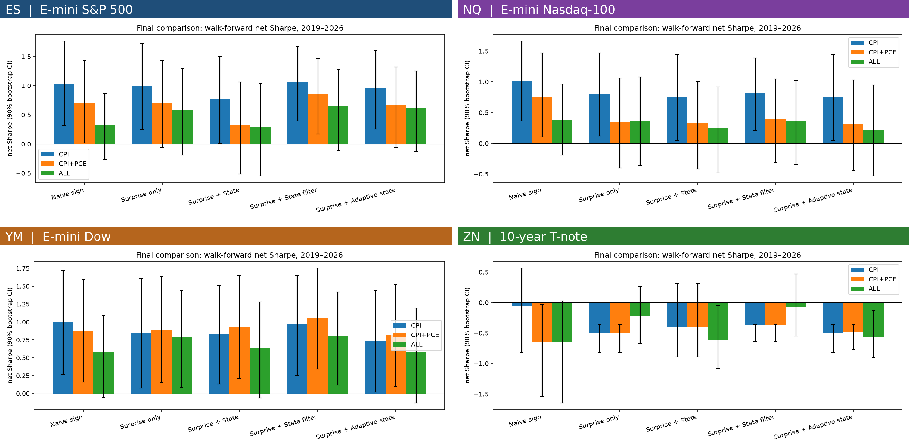

*Figure 19. Net Sharpe of the five strategies in the three universes (CPI; CPI + PCE; CPI + PCE + NFP), ES, NQ, YM and ZN.*

**Reading Figure 19 across markets.** In ES and NQ the CPI bars are the tallest for every strategy and the bars shrink as PCE and NFP are added: CPI carries the signal. YM is similar, but loses less when PCE and NFP are added (surprise only 0.84 → 0.89 → 0.78; naive 0.99 → 0.87 → 0.57). Within CPI, the naive rule and surprise only are at least as high as any state model. In ZN every bar is negative; the naive rule loses the most in the broader universes (−0.65) because it pays the 3 bps cost on every release, and the fitted models' bars rest on only 1–13 trades.

#### 6.4.5 Robustness

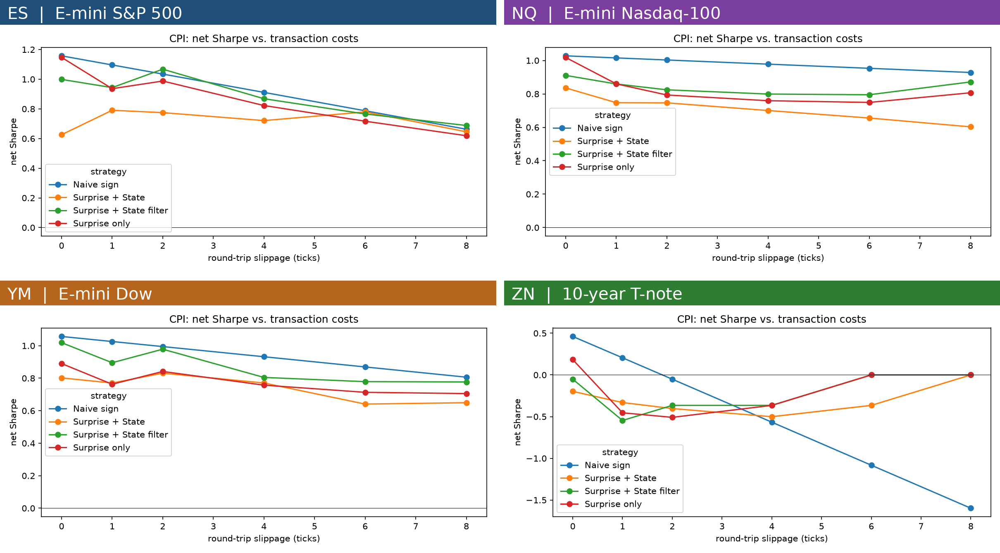

*Figure 20. CPI net Sharpe as round-trip slippage rises from 0 to 8 ticks (plus \$4.50 commission), ES, NQ, YM and ZN.*

**Reading Figure 20 across markets.** The lines slope down gently in **ES** (surprise only: 1.15 at 0 ticks, 0.62 at 8 ticks) and are almost flat in **NQ** (0.75–1.02), because one NQ tick is only about 0.1–0.3 bps of the contract value. **YM** is in between (naive 1.06 at 0 ticks, 0.81 at 8 ticks; surprise only 0.89 → 0.71). In **ZN** the naive rule starts positive (0.46 with commission only) and crosses zero at about 2 ticks, and the fitted models trade too rarely for the curve to be meaningful. Cost robustness is therefore a property of the **market's tick size relative to its moves**, not only of the strategy.

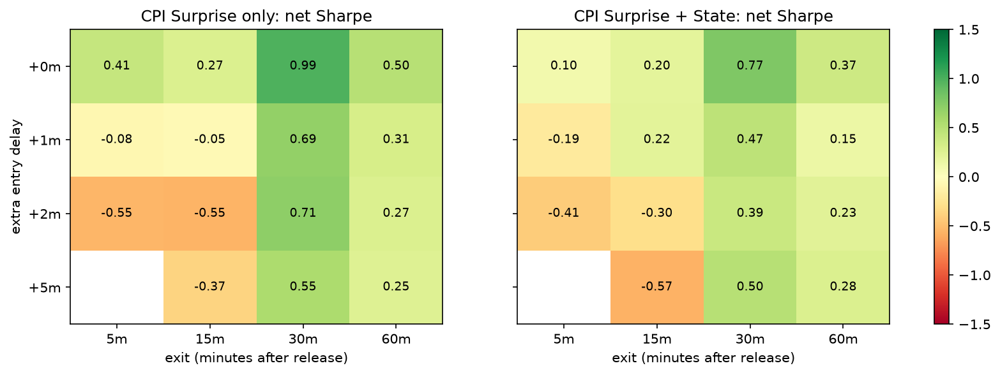

*Figure 21. ES: CPI surprise-only Sharpe by entry delay (rows) and holding period (columns).*

| Robustness (CPI, surprise only) | ES | NQ | YM | ZN |
|---|---|---|---|---|
| Sharpe at 0 → 8 ticks | 1.15 → **0.62** | 1.02 → **0.81** | 0.89 → **0.71** | naive: 0.46 at 0 ticks → −0.05 at 2 ticks |
| 30-min hold, entry delayed 1 / 2 / 5 min | 0.55–0.71 | 0.60 / 0.62 / 0.51 | 0.54 / 0.33 / 0.17 | all negative |
| 5-min hold, entry delayed 1 min | collapses | 0.43 → 0.05 | 0.47 → 0.07 | — |
| Surprise only ≥ surprise + state in every window/threshold variant | yes | yes | about equal (0.69–0.99) | not testable |

The edge is a **slow continuation over about 30 minutes**, not a fast reaction: short holds collapse with a one-minute delay, the 30-minute hold does not. In ES, NQ and YM the CPI strategy is robust to four times the base cost. YM is more sensitive to a delayed entry than ES and NQ.

#### 6.4.6 CPI alone vs a broader universe, and the peer format

| Net Sharpe, surprise only | CPI | CPI + PCE | CPI + PCE + NFP |
|---|---|---|---|
| ES | **0.99** | 0.71 | 0.59 |
| NQ | **0.79** | 0.34 | 0.37 |
| YM | 0.84 | **0.89** | 0.78 |

Adding PCE and NFP **dilutes** the CPI signal in ES and NQ; in YM the fitted model holds up because it trades only the NFP releases with a large predicted move.

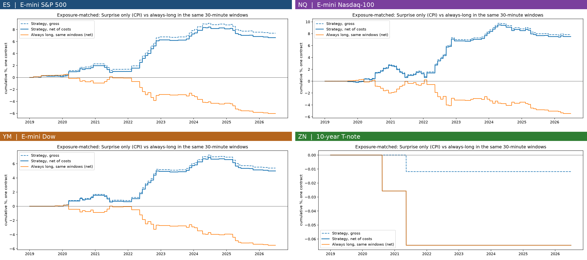

*Figure 22. CPI surprise only in the peer (DTW team) chart format: cumulative % of one contract, strategy gross (dashed) and net (solid) vs always-long in the same 30-minute windows (orange), ES, NQ, YM and ZN.*

**Reading Figure 22 across markets.** In ES, NQ and YM the strategy line climbs while the always-long line in the **same** windows falls (ES: +6.6% vs −6.0%; NQ: +7.5% vs −5.4%; YM: +5.0% vs −5.5%). Being in the market at CPI time earns nothing by itself; the profit comes entirely from the **direction** of the surprise. The gap between gross and net lines is small, confirming that costs are not the binding constraint for CPI. In ZN the strategy line is flat because the surprise model makes only two trades.

In the peer's daily format, ES CPI surprise only earns a total of 6.6% (daily Sharpe 0.97, max drawdown −1.8%, beta −0.001), while being **always long in the same windows loses 6.0%**: the direction of the surprise is worth about 13 percentage points. NQ is the same (+7.5% vs −5.4%), and so is YM (+5.0% vs −5.5%, beta −0.001).


---

### 6.5 Notebooks 05 and 05b: scaling from CPI to many releases

**Question (RQ5).** The CPI strategy trades only 7–12 times a year; the peer DTW strategy trades about 185 times a year on ES. If we trade the surprises of many releases, how many trades do we get, and does the edge survive?

**Design.** All 75 release families; each year the top 10 by the impact screen (history only) are traded, CPI always included. Line signs from the jump regression on history; family signal $x$ = mean of signed z-scores. Sizing: naive sign, per-family surprise model, or Jack's signal × volatility. Also tested: a second window (T+30 → T+60) and a two-window book. Credits: release-family rule, impact screen and volatility sizing from Jack Duncan; ±5σ winsorisation from Aaryen Mehta.

#### 6.5.1 Which releases does each market react to?

| Family rank in the impact screen, 2019–2026 | ES | NQ | YM | ZN |
|---|---|---|---|---|
| CPI | 1st–5th (1st from 2023) | 1st from 2022 | 1st from 2023 | 2nd–6th |
| Employment Report | 1st–4th | 1st–4th | 1st–2nd every year | 1st–3rd |
| FOMC rate decision | high from 2020, but ~no surprise to trade | 3rd–4th from 2021 | high, with interest on reserves at the same minute | **1st every year from 2020** |
| Also regularly admitted | Retail Sales, ISM Services, ISM Manufacturing | ISM Services, ISM Manufacturing, Retail Sales, U. of Michigan | ISM Manufacturing, ISM Services, Retail Sales, JOLTS, PPI; U. of Michigan from 2023 | ISM Services, ISM Manufacturing, S&P Global PMIs |

The signal is correctly signed out of sample for most families: corr(x, instant jump) in 2019–2026 is **+0.55 (ES), +0.56 (NQ), +0.54 (YM), +0.56 (ZN) for CPI**, and positive for most admitted families (in YM, Case-Shiller and FHFA have the wrong sign out of sample).

#### 6.5.2 How many trades, and how profitable?

| 2019–2026, net of costs | ES trades/yr | ES Sharpe | NQ trades/yr | NQ Sharpe | YM trades/yr | YM Sharpe | ZN trades/yr | ZN Sharpe |
|---|---|---|---|---|---|---|---|---|
| CPI · naive | 12 | 0.51 | 12 | 0.54 | 11 | 0.54 | 12 | −0.67 |
| CPI · surprise model | 9 | 0.76 | 11 | 0.55 | 9 | 0.45 | 0.1 | −0.37 |
| **CPI · signal × vol** | 12 | **0.77** | 12 | **0.74** | 11 | **0.61** | 12 | −0.29 |
| **All · naive** | **98** | **0.65** | **97** | **0.71** | **93** | **0.68** | 82 | −2.42 |
| All · surprise model | 43 | 0.11 | 66 | 0.37 | 57 | 0.34 | 2 | −0.74 |
| All · signal × vol | 101 | 0.56 | 100 | 0.37 | 96 | 0.29 | 84 | −1.11 |
| Combined (CPI model + others × vol) | 98 | 0.40 | 101 | 0.23 | 95 | 0.16 | 72 | −1.25 |
| All · signal × vol · 2 windows | 201 | 0.16 | 199 | 0.00 | 193 | −0.12 | 168 | −2.02 |
| *Peer: Jack DTW (slide, ES)* | *185* | *0.61* | | | | | | |

| All · naive (the multi-release book) | ES | NQ | YM | ZN |
|---|---|---|---|---|
| Trading days per year | 91 | 90 | 90 | — |
| Net bps per trade | 1.7 | 2.4 | 1.7 | −3.4 |
| Total net P&L | 12.8% | 17.5% | 12.0% | −20.5% |
| Max drawdown | −4.8% | −5.7% | −4.5% | −20.6% |
| Sharpe 2019–21 / 2022–26 | 0.32 / 0.83 | 0.35 / 0.91 | 0.61 / 0.72 | −3.36 / −2.17 |
| **Sharpe excluding 2022** | **0.28** | **0.44** | **0.40** | −2.53 |
| **Random-sign p** | **< 0.001** | **0.005** | **0.006** | 0.81 |
| Sharpe at 0 / 1 / 2 / 4 ticks | 1.09 / 0.87 / 0.65 / 0.20 | 0.82 / 0.77 / 0.71 / 0.60 | 0.91 / 0.80 / 0.68 / 0.45 | −0.56 / −1.49 / −2.42 / −4.24 |
| Second window alone (T+30 → T+60) | −0.79 | −0.23 | −0.15 | −3.08 |

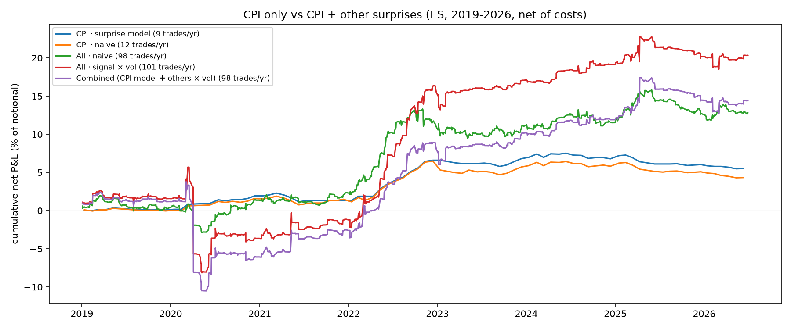

*Figure 23. ES: cumulative net P&L of CPI-only and multi-release books.*

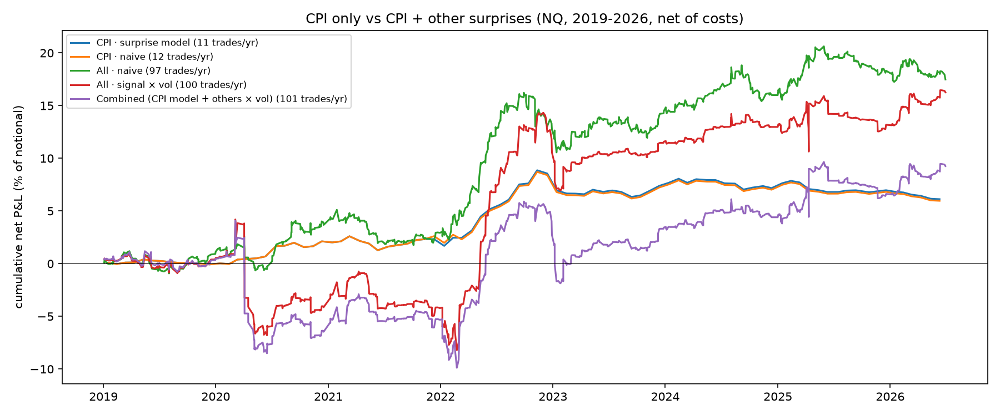

*Figure 24. NQ: the same books.*

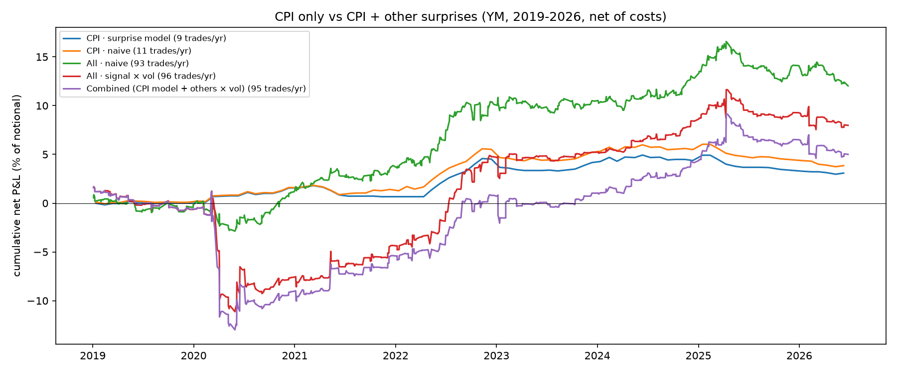

*Figure 24b. YM: the same books.*

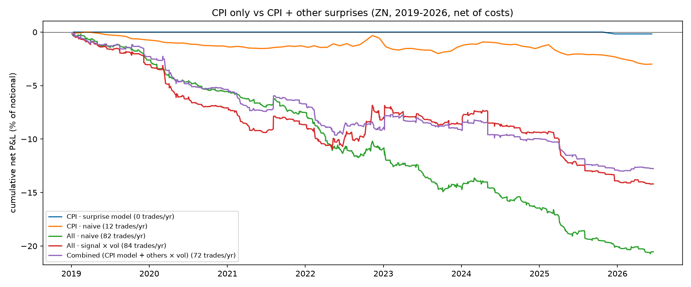

*Figure 25. ZN: every book loses money after costs.*

#### 6.5.3 Which releases earn money?

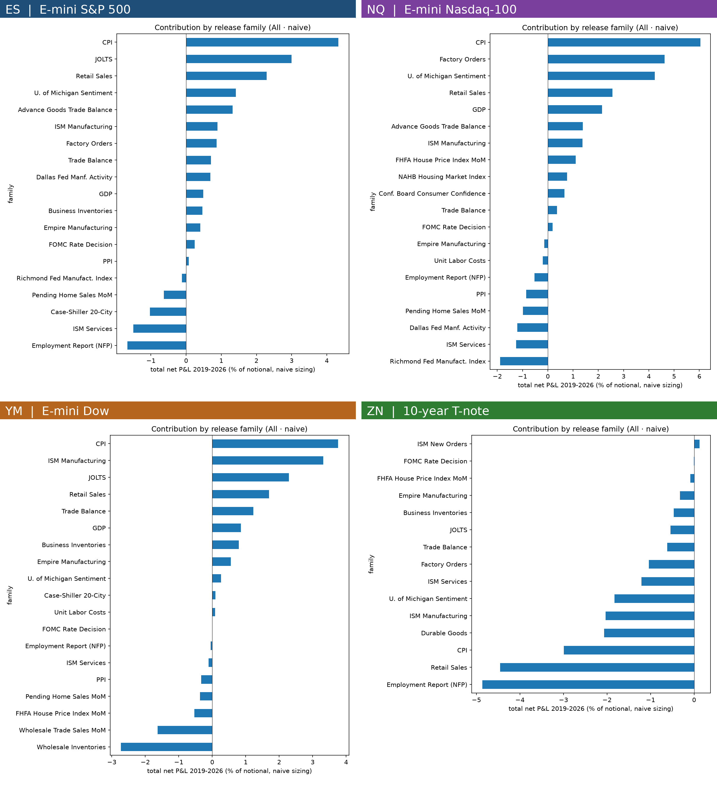

*Figure 26. Total net P&L of the multi-release naive book by release family, 2019–2026 (% of notional, one contract per trade), ES, NQ, YM and ZN.*

**Reading Figure 26 across markets.** In the equity markets the bars are mostly to the right, and **CPI is the largest contributor in all three** (ES +4.3%, NQ +6.0%, YM +3.8%). Behind CPI the order differs (ES: JOLTS, Retail Sales, U. of Michigan; NQ: Factory Orders, U. of Michigan, Retail Sales, GDP; YM: ISM Manufacturing, JOLTS, Retail Sales, Trade Balance), which is itself a warning: apart from CPI (and JOLTS and Retail Sales, which earn in ES and YM), no family's contribution is stable across the indices, so the broad book should be seen as diversification across many small, noisy edges. The ES and NQ books both lose on the **Employment Report** and **ISM Services** (in YM the Employment Report earns nothing), the two releases whose several components often point in opposite directions. In ZN almost every bar is to the left, and the largest losses are on the releases ZN reacts to most (Employment Report −4.9%, Retail Sales −4.5%, CPI −3.0%): the bond market reprices them in the first minute, and each trade afterwards pays about 3 bps for nothing.

- **ES:** CPI +4.3%, JOLTS +3.0%, Retail Sales +2.3%, U. of Michigan +1.4%; Employment Report −1.7%, ISM Services −1.5%.
- **NQ:** CPI +6.0%, Factory Orders +4.6%, U. of Michigan +4.2%, Retail Sales +2.6%, GDP +2.1%; Richmond Fed −1.9%, ISM Services −1.3%.
- **YM:** CPI +3.8%, ISM Manufacturing +3.3%, JOLTS +2.3%, Retail Sales +1.7%, Trade Balance +1.2%; Employment Report about zero (−0.05 bps per trade), Wholesale Inventories −2.7%, Wholesale Trade Sales −1.6%.
- **ZN:** every family with more than 4 trades loses about the cost on every trade.

No family except CPI comes close to individual significance: the multi-release book works through **diversification across many small edges**.

#### 6.5.4 An important finding: the definition of the CPI surprise

The ES CPI naive book in Notebook 05 (Sharpe 0.51) is weaker than in Notebook 04 (1.03) **with identical trade returns**. Notebook 04 uses the headline CPI MoM surprise; Notebook 05 averages all eight CPI lines. The two disagree in direction on **20 of 86 releases**, mostly months where the headline surprise was almost exactly zero (|z| < 0.2), and those 20 trades swing P&L by about 4.3 percentage points (one release, January 2023, is worth +115 bps under one definition and −118 bps under the other). The same gap appears in NQ (1.00 vs 0.54) and YM (0.99 vs 0.54). The surprise-model and volatility-sized versions, which trade little on small surprises, are more stable.

#### 6.5.5 Interpretation

- **The trade count can be raised tenfold.** About 10 screened releases give ~100 trades a year per market, against ~10 for CPI alone.
- **The edge survives in equity futures.** Sharpe 0.65 (ES), 0.71 (NQ) and 0.68 (YM), comparable to the peer DTW strategy (0.61) with a larger edge per trade (1.7–2.4 vs 1.2 bps) and an economically explained signal.
- **More releases bring less dependence on 2022,** especially in NQ and YM (ex-2022 Sharpe 0.44 and 0.40).
- **Costs matter more for the broad book.** In ES its Sharpe falls to 0.20 at 4 ticks; NQ is far more robust (0.60) because a tick is a smaller share of the NQ price, and YM is in between (0.45).
- **The effect lasts about 30 minutes.** A second window loses money in every market, so the honest ceiling is about **100 trades a year per market** at one trade per release.
- **The simplest sizing works best.** Per-family surprise models have too little history (~24 releases per family) and volatility sizing raises drawdowns.

---

### 6.6 Notebooks 06 and 06b: surprise plus DTW pattern, and the five-window ladder

**Question (RQ6).** Does the shape of the price path around a release add information beyond the surprise? And can trading five consecutive windows after each release (the peer's structure) reach ~185 trades a year profitably?

**Design.** The peer DTW specification (Section 3.2) on the same releases, entry, exit, costs and window as Notebook 05. Four combinations: surprise only, DTW only, surprise + DTW agree, surprise + DTW blend. Then the **ladder**: five windows after each release (T+1→T+30, …, T+120→T+150), with DTW rebuilt for each window.

#### 6.6.1 Does DTW predict the 30-minute return?

| DTW, all releases 2019–2026 | ES | NQ | YM | ZN |
|---|---|---|---|---|
| Releases with a DTW signal | 5,181 | 5,229 | 5,232 | 5,244 |
| **Rank IC** with the 30-min return | **+0.010** | **+0.026** | **+0.030** | **+0.039** |
| Hit rate of the sign | 49.2% | 50.9% | 51.0% | 46.6% |
| corr(DTW, surprise) | 0.11 | 0.07 | 0.13 | 0.02 |

A useful directional signal in this setting would show a rank IC of about 0.05–0.10, stable across years. DTW is close to zero in every market and unrelated to the surprise.

#### 6.6.2 Does adding DTW improve the surprise strategy?

| Net Sharpe, ~10 releases | ES | NQ | YM | ZN |
|---|---|---|---|---|
| **Surprise only** | **0.65** | **0.71** | **0.68** | −2.42 |
| Surprise + DTW agree | 0.31 | 0.62 | 0.94 (P(not better) 0.23) | −1.57 |
| Surprise + DTW blend | 0.41 | 0.67 | **1.06** (P(not better) 0.06) | −1.51 |
| DTW only | −0.39 | 0.08 | 0.47 | −1.25 |
| CPI: surprise model → + DTW agree | 0.76 → 0.93 (P(not better) 0.21) | 0.55 → 0.54 | 0.45 → 0.32 | — |
| CPI: DTW only | 0.32 | 0.81 (not significant) | 0.41 | −0.55 |

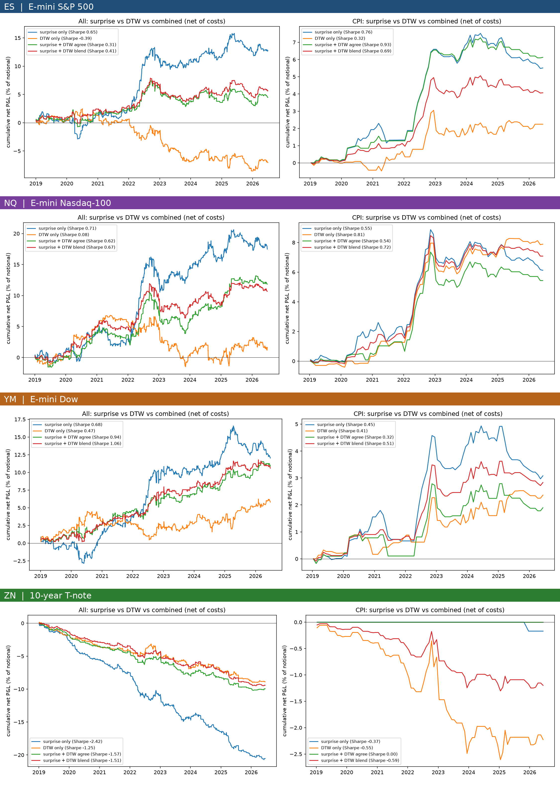

*Figure 27. Cumulative net P&L of surprise only, DTW only, surprise + DTW agree and surprise + DTW blend, for the ~10-release universe (left) and CPI (right), ES, NQ, YM and ZN. Sharpe ratios in the legends.*

**Reading Figure 27 across markets.** In **ES** (all releases) the surprise-only line rises in steps, mostly in 2022, while the DTW-only line is flat until 2022 and then falls steadily to about −7%; the two combinations sit between them, closer to zero. In **NQ** DTW only actually rises in 2019–2022 (it was positive in the first half of the sample) but gives it all back from 2023, a typical sign of a pattern that does not persist; again surprise only is the highest line. For CPI the four lines move together, because CPI's surprise and DTW agree on most of the large 2022 moves; the differences between them are small and point in different directions in ES and NQ. **YM** is the exception: DTW only rises slowly (0.47), and the agree and blend lines are smoother than surprise only and avoid its 2020 drawdown, ending at Sharpe 0.94 and 1.06 against 0.68. In **ZN** every line falls almost linearly: the loss is essentially the cost paid on each trade, and the surprise line falls fastest because it trades most.

- In ES and NQ **every combination lowers the Sharpe** of the multi-release surprise book.
- **YM is the one market where combining helps in the point estimates:** the blend raises the Sharpe from 0.68 to 1.06 and cuts the drawdown from −4.5% to −1.5%, in both 2019–2021 and 2022–2026. When DTW agrees with the surprise the trade earns 2.9 bps; when it disagrees, 0.3 bps. But the bootstrap probability that the blend is not better is 6%, it is one of many combinations tested across markets, and it does not appear in ES or NQ, so we report it as promising but unconfirmed.
- For CPI the results **point in different directions in different markets** (ES: the agreement filter looks best; NQ: DTW alone looks best), and none is significant. We treat them as noise.
- In ZN, DTW books lose less than the surprise only because they trade less and pay less cost.
- DTW does not separate good surprise trades from bad ones in ES (trades where DTW disagreed earned *more*, +2.4 vs +1.1 bps).

#### 6.6.3 The ladder: can we reach ~185 trades a year?

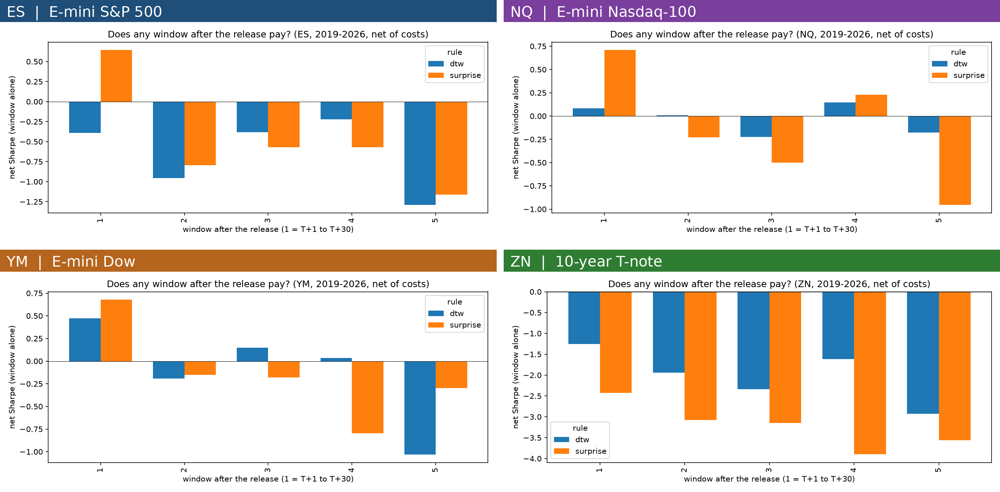

*Figure 28. Net Sharpe of the surprise signal and the DTW signal traded alone in each of the five 30-minute windows after the release, ES, NQ, YM and ZN.*

**Reading Figure 28 across markets.** The ES and NQ panels have the same shape: **only window 1 is clearly positive, and only for the surprise** (ES +0.65, NQ +0.71). From window 2 onwards the surprise bars are negative in ES and mostly negative in NQ, and the DTW bars are near zero or negative in every window. NQ's small positive window 4 (+0.23 surprise, +0.15 DTW) has a rank IC of about 0.02 and is best read as noise. YM has the same shape: window 1 earns 0.68 for the surprise and 0.47 for DTW, and windows 2–5 range from −0.80 to −0.15 (surprise) and −1.03 to +0.15 (DTW). In ZN every bar is deeply negative (−1.2 to −3.9): no window pays for either signal.

| Surprise rank IC by window | ES | NQ | YM | ZN |
|---|---|---|---|---|
| **W1: T+1 → T+30** | **+0.139** | **+0.088** | **+0.091** | −0.026 |
| W2: T+30 → T+60 | +0.008 | −0.014 | +0.047 | −0.011 |
| W3: T+60 → T+90 | −0.055 | −0.056 | +0.017 | +0.010 |
| W4: T+90 → T+120 | +0.001 | +0.022 | −0.057 | −0.044 |
| W5: T+120 → T+150 | +0.005 | −0.041 | +0.042 | +0.038 |

| Ladder books: trades/yr, Sharpe | ES | NQ | YM | ZN |
|---|---|---|---|---|
| **Surprise, window 1 only** | **98, +0.65** | **97, +0.71** | **93, +0.68** | 82, −2.42 |
| Surprise W1 + DTW W2–5 | 348, −0.75 | 342, +0.27 | 329, 0.00 | 294, −5.35 |
| Surprise ladder (5 windows) | 490, −1.00 | 484, −0.29 | 463, −0.34 | 410, −7.65 |
| DTW ladder (5 windows) | 314, −1.23 | 309, −0.07 | 298, −0.23 | 267, −3.92 |
| *Peer: Jack DTW (slide, ES)* | *185, +0.61* | | | |

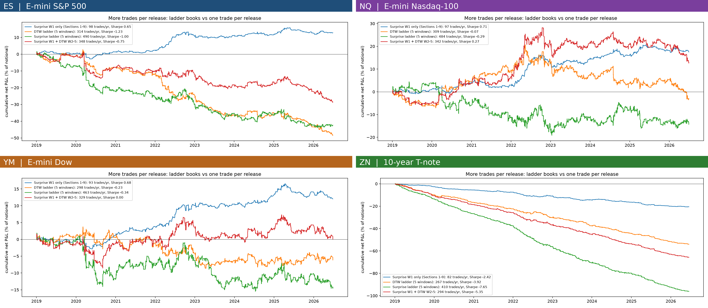

*Figure 29. Cumulative net P&L of the three ladder books (DTW ladder, surprise ladder, surprise W1 + DTW W2–5) against window 1 only, ES, NQ, YM and ZN.*

**Reading Figure 29 across markets.** In **ES** window 1 alone is the only line that ends positive (+12.8%); every ladder book falls steadily, to between −29% and −48%, because each extra window adds about 1–2 bps of cost with no edge. In **NQ**, where the cost is below 1 bps, the ladder books lose much less and "surprise W1 + DTW W2–5" even ends positive (+12.9%), but it is still below window 1 alone (+17.5%) with a drawdown three times larger. In **YM** window 1 alone ends at +12.0%, while the ladder books end between −14% and 0%. In **ZN** every ladder book loses between 54% and 96% of notional. The chart makes the trade-count trade-off visible: more windows per release add turnover and cost, not profit.

**Interpretation.** The surprise's information is strong in the first 30 minutes (rank IC 0.14 in ES, 0.09 in NQ and YM) and **gone afterwards** in every market. DTW has no reliable information in any window. The ladder books trade 270–490 times a year, more than the peer's 185, but every added window lowers the Sharpe: the trade count can be raised only by adding losing (or, in NQ, weaker) trades.

---

### 6.7 Notebooks 07 and 07b: the multi-market portfolio

**Question (RQ7a).** Does combining ES, NQ and ZN improve the surprise strategy? And does adding YM to ES and NQ improve the equity book (Notebook 07b)?

**Design.** Notebooks 05 and 06 run end-to-end in each market (own impact screen, own line signs, own DTW), then combined with equal-risk weights estimated from history only (inverse standard deviation of each market's 30-minute trade return, ES = 1; ZN receives a weight of about 2.7).

| 2019–2026, net of costs | Trades / yr | Net bps / trade | Total net P&L | Sharpe | Sharpe ex-2022 | Max DD | Random-sign p |
|---|---|---|---|---|---|---|---|
| ES · All · naive | 98 | 1.7 | 12.8% | 0.65 | 0.28 | −4.8% | < 0.001 |
| NQ · All · naive | 97 | 2.4 | 17.5% | 0.71 | 0.44 | −5.7% | 0.005 |
| YM · All · naive | 93 | 1.7 | 12.0% | 0.68 | 0.40 | −4.5% | 0.006 |
| ZN · All · naive | 82 | −3.3 | −20.5% | −2.42 | −2.53 | −20.6% | 0.81 |
| **ES + NQ · All · naive** | **195** | 1.7 | **25.2%** | **0.72** | 0.38 | −7.4% | **< 0.001** |
| ES + NQ · CPI · surprise model | 20 | 6.4 | 9.9% | 0.69 | 0.02 | −3.3% | 0.023 |
| **ES + NQ + YM · All · naive** (07b) | **288** | 1.7 | **37.5%** | **0.78** | **0.43** | −9.2% | **< 0.001** |
| ES + NQ + YM · CPI · surprise model (07b) | 29 | 5.9 | 13.0% | 0.63 | −0.04 | −5.3% | 0.020 |
| 3-market (ES+NQ+ZN) · All · naive | 277 | −1.4 | −29.7% | −0.75 | −1.17 | −31.1% | |
| 4-market · All · naive (07b) | 370 | −0.6 | −17.4% | −0.34 | −0.75 | −23.4% | |
| 3-market · CPI · surprise model | 21 | 6.1 | 9.4% | 0.65 | −0.03 | −3.8% | 0.019 |
| 3-market · CPI · surprise + DTW agree | 14 | 9.7 | 10.0% | 0.78 | 0.08 | −2.4% | 0.009 |
| *Peer: Jack DTW, ES (slide, 2018–26)* | *185* | *1.2* | *18.6%* | *0.61* | | *−4.9%* | |

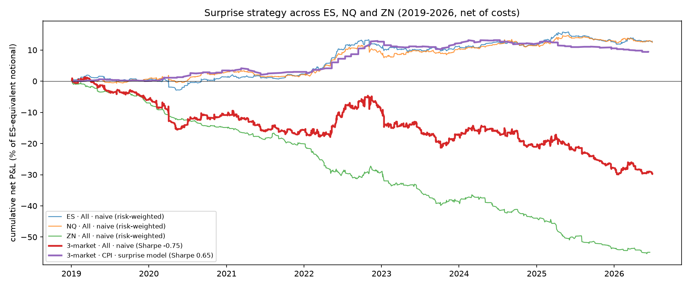

*Figure 30. Cumulative net P&L of the single-market and multi-market books.*

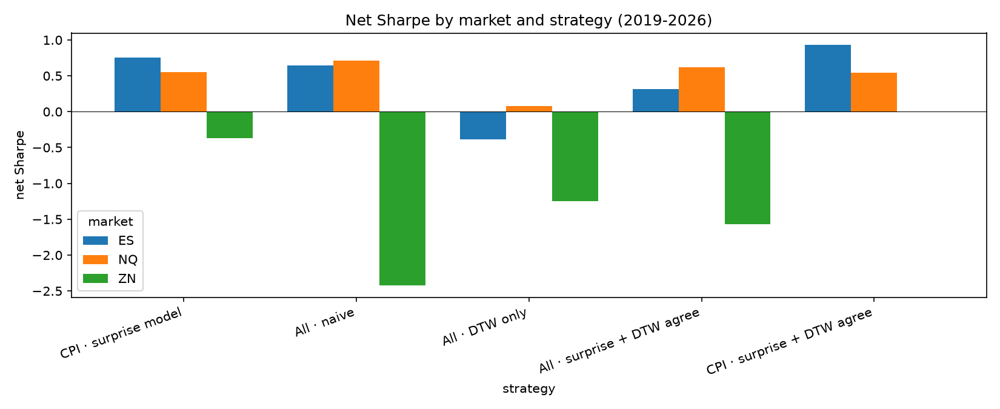

*Figure 31. Net Sharpe of each strategy by market.*

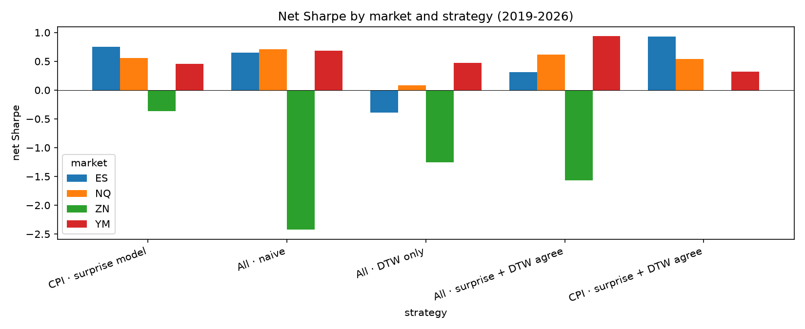

*Figure 31b. Notebook 07b: net Sharpe by market and strategy, ES, NQ, ZN and YM.*

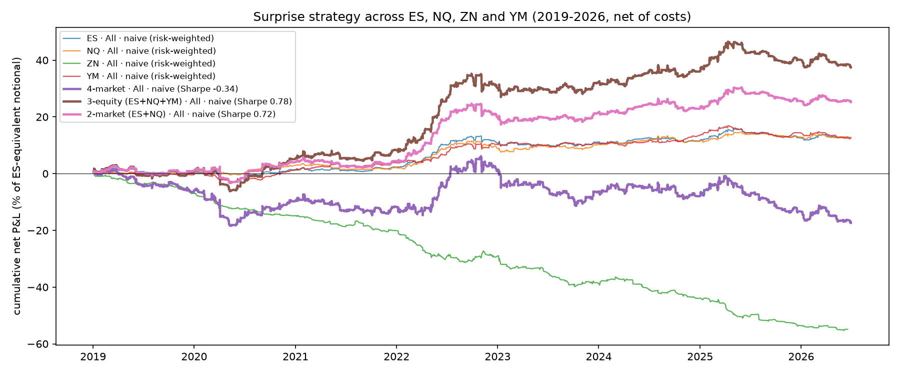

*Figure 31c. Notebook 07b: cumulative net P&L of the single-market books (risk-weighted) and of the two-, three- and four-market portfolios. Equal-risk weights fixed on 2016–2018: ES 1.00, NQ 0.71, YM 1.02, ZN 2.67.*

**Adding YM (Notebook 07b).** YM's first-minute CPI jump moves almost one for one with ES's (correlation 0.99), and its line signs are the same as ES's. Yet the monthly returns of the multi-release books are much less correlated (YM–ES 0.66, YM–NQ 0.43, against ES–NQ 0.79), because each market admits and trades a different set of families. As a result, adding YM to ES + NQ raises the Sharpe from 0.72 to **0.78**, total net P&L from 25% to **38%**, trades from 195 to **288 a year**, and moves the 90% confidence interval fully above zero (**0.10 to 1.50**). The cost is a larger drawdown (−9.2% against −7.4%). For the CPI model YM adds little (0.69 → 0.63), because the three CPI books are highly correlated.

**At the peer's cost assumption (¼ tick per side, no commission):**

| Sharpe | ours: 2 ticks + \$4.50 | ¼ tick per side | gross |
|---|---|---|---|
| ES · All · naive | 0.65 | **1.06** | 1.17 |
| NQ · All · naive | 0.71 | 0.84 | 0.87 |
| YM · All · naive | 0.68 | 0.96 | 1.01 |
| ES + NQ · All · naive | 0.72 | **1.01** (total 35.8%) | 1.09 |
| **ES + NQ + YM · All · naive** | **0.78** | **1.10** (total 53.2%) | 1.18 |
| ZN · All · naive | −2.42 | −0.76 | −0.30 |

**Interpretation.** ES and NQ combine well: **~195 trades a year, Sharpe 0.72, total +25%**, above the peer's trade count with a higher Sharpe. Adding YM makes the best book of the study: **ES + NQ + YM, ~290 trades a year, Sharpe 0.78 (1.10 at the peer's cost), total +38%**, with no market beta. YM was added after the ES and NQ results were known, and the improvement is small next to the confidence intervals, but every setting was fixed before YM was run. Adding ZN destroys the portfolio: it has no edge, its risk weight is the largest, and it loses even gross of costs. The directional signs are economically consistent across markets (a hot CPI print pushes all four down; strong payrolls push ES, NQ and YM up and ZN down), but in ZN the direction is fully priced in the first minute.

---

### 6.8 Notebooks 08 and 08b: the four team workstreams at equal costs

**Question (RQ7b).** The four team members reported results with different cost assumptions, windows, entry times and Sharpe methods. How do they compare on equal terms?

**Design.** Each workstream's **own trades** are re-priced under four cost scenarios (gross; the peer's ¼ tick per side; ½ tick per side; our 2 ticks + \$4.50), on the same window (2019–2026) and with the same Sharpe method. Jack Duncan's trade log is not in the repository, so his ES DTW ladder is **rebuilt from its specification** (`src/team_replication.py`); the rebuild gives 310 trades/yr and Sharpe 0.16 on 2018–2026 at his cost, against his slide's 185 and 0.61, so it is an approximation of his strategy, not his exact result. Aaryen Mehta's classifier is shown both **as reported** (entry at the pre-release price, lag 0) and **executable** (entry one minute later, lag 1). Notebook 08b adds the YM and ES + NQ + YM books from Notebook 07b; everything else is unchanged.

| Net Sharpe (monthly), 2019–2026 | Trades / yr | Gross | ¼ tick per side | ½ tick per side | 2 ticks + \$4.50 |
|---|---|---|---|---|---|
| **Reza · ES · all releases (surprise)** | 98 | 1.17 | **1.06** | 0.95 | **0.65** |
| **Reza · ES + NQ · all releases** | 195 | 1.09 | **1.01** | 0.94 | **0.72** |
| **Reza · ES + NQ + YM · all releases** (08b) | **288** | 1.18 | **1.10** | 1.02 | **0.78** |
| Reza · YM · all releases (08b) | 93 | 1.01 | 0.96 | 0.90 | 0.68 |
| Reza · NQ · all releases | 97 | 0.87 | 0.84 | 0.82 | 0.71 |
| Reza · ES · CPI surprise model | 9 | 0.88 | 0.85 | 0.83 | 0.76 |
| Aaryen · 30 min, **as reported (lag 0)** | 55 | 2.04 | 2.03 | 2.01 | 1.97 |
| Aaryen · 30 min, **executable (lag 1)** | 55 | 1.08 | 1.03 | 0.98 | 0.84 |
| Aaryen · 10 min, executable | 55 | 0.32 | 0.25 | 0.17 | −0.04 |
| Hoshea · ES · DTW event games | 372 | 0.44 | 0.24 | 0.04 | −0.50 |
| Jack · ES · DTW 5-window ladder (rebuild) | 315 | 0.31 | 0.10 | −0.11 | −0.68 |
| *Jack · slide (2018–26, his data and costs)* | *185* | | *0.61* | | |

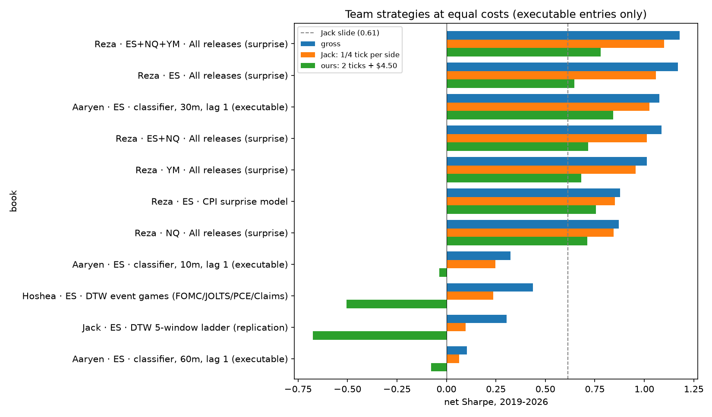

*Figure 32. Net Sharpe of every executable workstream under three cost levels, including the YM and ES + NQ + YM books (Notebook 08b).*

#### 6.8.1 All four together, three cost levels

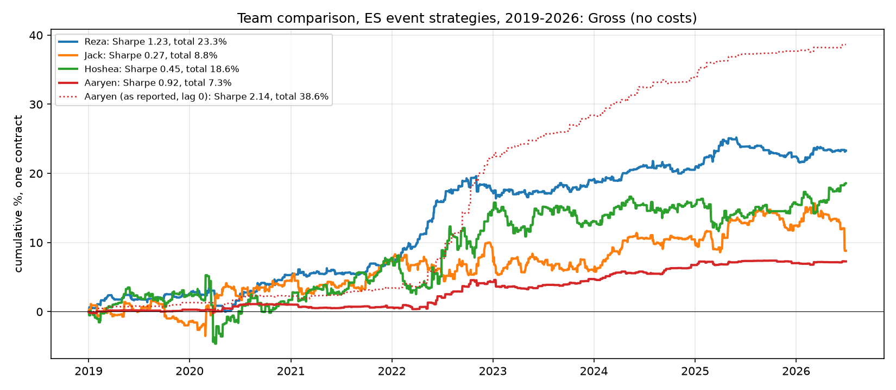

*Figure 33. Cumulative P&L (one contract), gross of costs: Reza (ES, all releases), Jack (rebuild), Hoshea, Aaryen (executable; dotted: as reported).*

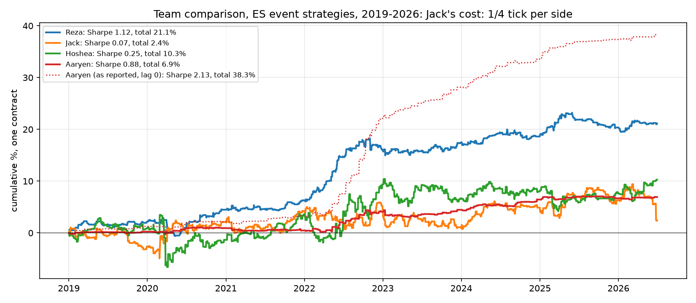

*Figure 34. The same at ¼ tick per side.*

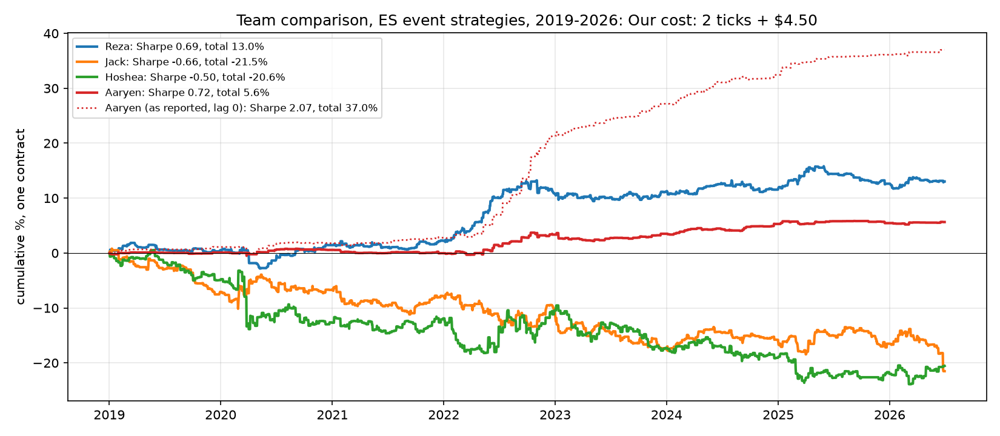

*Figure 35. The same at 2 ticks + \$4.50.*

| Daily Sharpe (√252) / total % | Gross | ¼ tick per side | 2 ticks + \$4.50 |
|---|---|---|---|
| **Reza** (ES, all releases) | **1.23 / 23.3%** | **1.12 / 21.1%** | **0.69 / 13.0%** |
| **Reza** (ES + NQ + YM, 08b) | **1.17 / 56.9%** | **1.09 / 53.2%** | **0.78 / 37.8%** |
| Jack (rebuild) | 0.27 / 8.8% | 0.07 / 2.4% | −0.66 / −21.5% |
| Hoshea | 0.45 / 18.6% | 0.25 / 10.3% | −0.50 / −20.6% |
| Aaryen (executable) | 0.92 / 7.3% | 0.88 / 6.9% | 0.72 / 5.6% |
| Aaryen (as reported) | 2.14 / 38.6% | 2.13 / 38.3% | 2.07 / 37.0% |

#### 6.8.2 One workstream at a time, in the peer's slide format

The notebook also shows each workstream in the format of the peer's slide: net, net at our cost, gross, always-long in the same windows, and buy-and-hold.

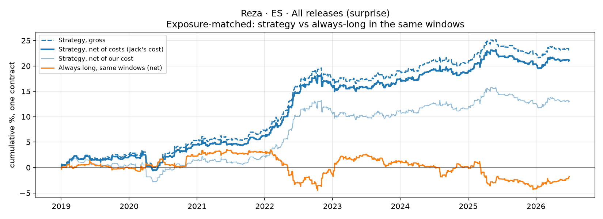

*Figure 36. Reza, ES all releases: strategy vs always-long in the same windows.*

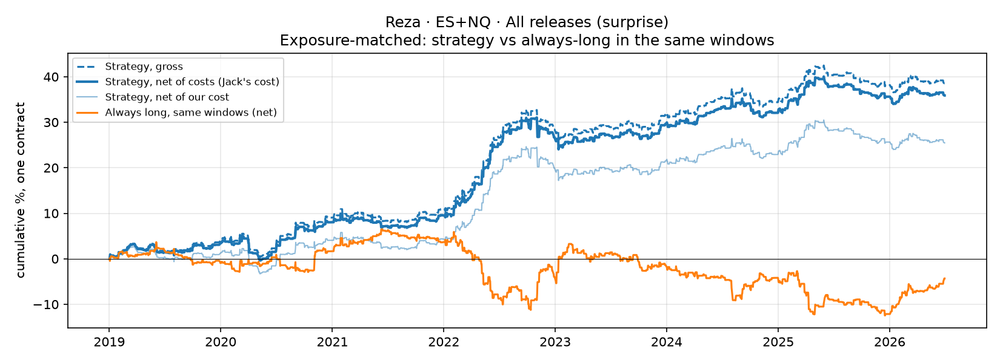

*Figure 37. Reza, ES + NQ all releases.*

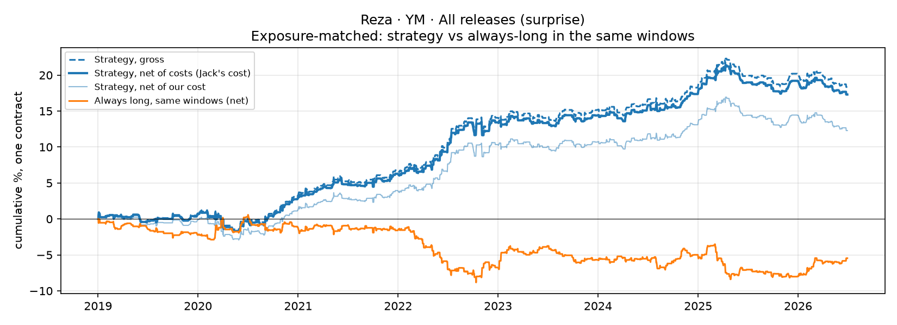

*Figure 37b. Reza, YM all releases (Notebook 08b).*

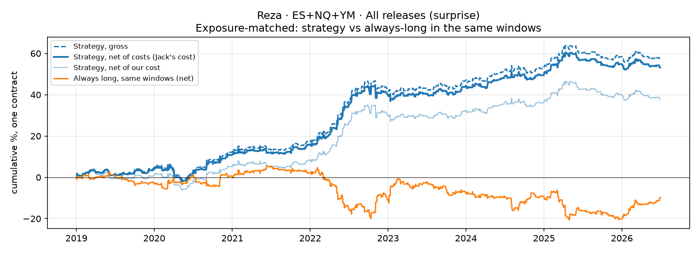

*Figure 37c. Reza, ES + NQ + YM all releases (Notebook 08b).*

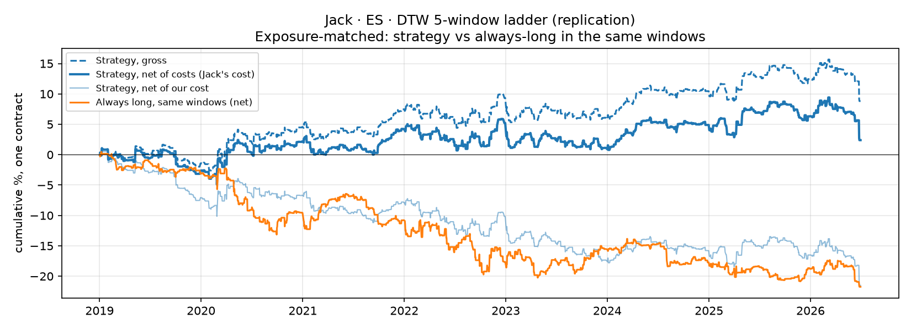

*Figure 38. Jack, DTW ladder (rebuild).*

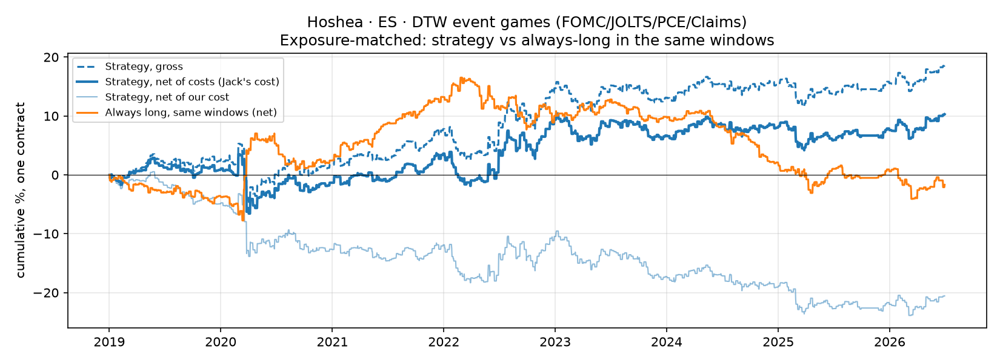

*Figure 39. Hoshea, DTW event games.*

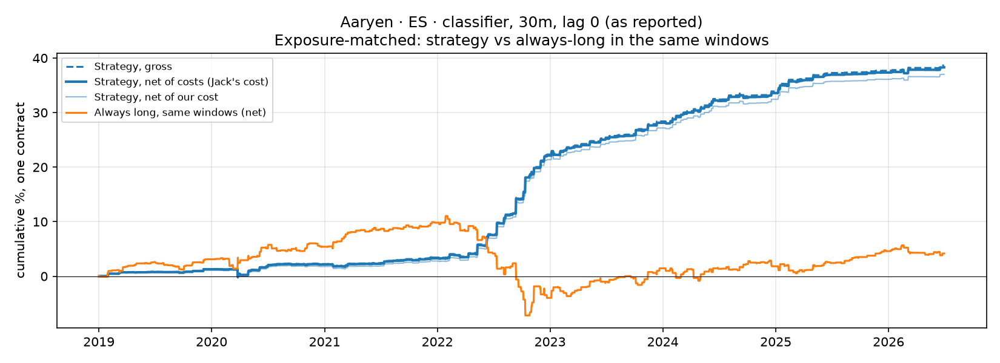

*Figure 40. Aaryen, 30-minute classifier, as reported (entry at the pre-release price).*

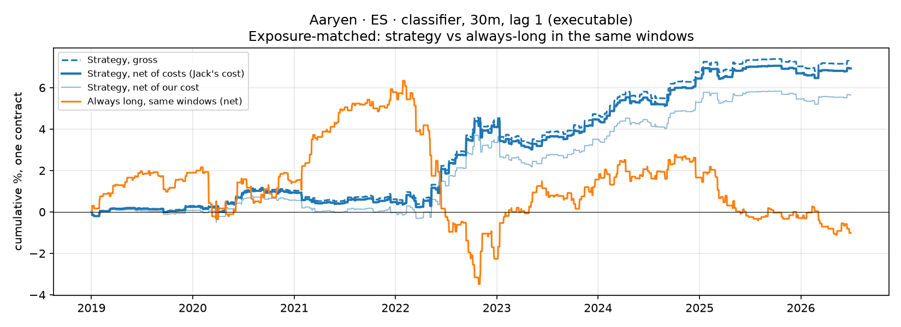

*Figure 41. Aaryen, 30-minute classifier, executable (entry one minute later).*

| Slide format, ¼ tick per side, 2019–2026 | Total % | Vol % | Daily Sharpe | Max DD | Beta | Trades / yr | Always long, same windows |
|---|---|---|---|---|---|---|---|
| Reza · ES · all releases | 21.1 | 2.6 | 1.12 | −3.7% | −0.001 | 98 | −1.8% |
| Reza · ES + NQ | 35.9 | 4.7 | 1.06 | −7.0% | 0.002 | 195 | −4.3% |
| Reza · YM · all releases (08b) | 17.3 | 2.6 | 0.93 | −4.1% | −0.004 | 93 | −5.5% |
| **Reza · ES + NQ + YM** (08b) | **53.2** | 6.7 | **1.09** | −8.3% | −0.002 | 288 | −9.8% |
| Jack · rebuild | 2.4 | 4.5 | 0.07 | −7.0% | 0.005 | 315 | −21.7% |
| Hoshea | 10.3 | 5.7 | 0.25 | −10.1% | 0.010 | 372 | −1.7% |
| Aaryen · executable | 6.9 | 1.1 | 0.88 | −1.4% | −0.004 | 55 | −1.0% |
| Aaryen · as reported | 38.3 | 2.5 | 2.13 | −1.5% | −0.006 | 55 | +4.2% |
| *Jack · slide (his data, 2018–26)* | *18.6* | *3.0* | *0.61* | *−4.9%* | *−0.005* | *185* | |

**Interpretation.**

- **Entry timing explains the largest difference in the team.** Aaryen's classifier loses about **80% of its profit** (38.6% → 7.3% gross) when the entry moves from the pre-release price to one minute after the release; its Sharpe falls from about 2.1 to 0.9. The first minute is where the market prices the news, and it cannot be traded. Jack's independent rebuild of Aaryen's model found the same (about 96% of profit per trade lost).
- **Costs explain the second largest.** The high-turnover DTW strategies (300+ trades a year) are positive only at ¼ tick per side; at 2 ticks + \$4.50 they lose about 20%. The surprise strategy trades a third as often with more edge per trade, so it survives realistic costs.
- **At equal costs and an executable entry, the macro-surprise book has the highest total return in the team at every cost level, and the highest Sharpe at gross and ¼-tick costs.** With YM added (Notebook 08b), the ES + NQ + YM book earns 1.10 at ¼ tick per side and 0.78 at 2 ticks + \$4.50, against 1.03 and 0.84 for Aaryen's executable classifier. At our 2-tick cost, Aaryen's executable 30-minute classifier has a similar or slightly higher Sharpe (monthly 0.84 vs 0.72 for ES + NQ), but with far fewer trades (55 vs 195 a year) and a much smaller total return (5.6% vs 25%). The two are built on related inputs (both use the macro surprise), which supports the conclusion that the surprise is the source of the executable edge.


---

## 7. Discussion

### 7.1 Why does a drift exist in equity futures, and not in bonds?

Figure 2 and Sections 6.2–6.3 show the same pattern: a large jump at the release, then a drift in the same direction for about 30 minutes in ES, NQ and YM, and almost none in ZN. Several explanations are consistent with the evidence:

- **Interpretation takes time for equities.** A CPI print maps into bond prices almost mechanically (expected policy rate → yield). For equities, investors must also judge the effect on growth, margins and risk premia, and large asset managers rebalance over minutes rather than milliseconds. The fact that the drift is stronger in **NQ**, whose value depends more on long-dated cash flows, fits this channel.
- **Liquidity after the release.** Order books are thin in the seconds after a release and refill over the following minutes. Part of the drift may be price discovery as liquidity returns.
- **The bond market is the first mover.** Treasury futures are where the rate information is priced directly and by the fastest participants. By the time a strategy can enter ZN, the move is complete.
- **Costs relative to moves.** Even with some drift, ZN's cost (3 bps per round trip) is large relative to its post-release moves (mean |30-min drift| 10.5 bps for CPI). ES, NQ and YM have larger moves and, in NQ's and YM's case, a cost of 1 bps or less.

### 7.2 The edge is regime-dependent

Around 75–80% of the CPI strategy's profits came from 2022, when inflation was the market's dominant concern and every CPI print moved the expected Fed path. The multi-release book spreads its risk across ~10 releases and depends less on one regime (Sharpe ex-2022: 0.28 in ES, 0.44 in NQ, 0.40 in YM), but it is also strongest in 2022–2026. The practical reading is that **macro-surprise trading pays when macro data drive policy expectations**: a live implementation should scale up when inflation or labour data are the market's main theme and down when they are not.

### 7.3 The pre-event state: size, not direction

The state results are a clear example of the difference between **in-sample explanation** and **out-of-sample trading**:

- In sample (Notebook 03), volatility clearly changes both the size of the move and the CPI surprise beta in ES, NQ and YM.
- Out of sample (Notebook 04), no state model beats surprise only, because (i) the effect is mostly on the untradeable first-minute jump, (ii) it became detectable in real time only in 2022, and (iii) the "best" state changed from year to year.

The state is still valuable for **risk management**: in high-volatility states the 30-minute move is about 20 bps larger, so position sizes and stop-losses should be scaled by volatility even though the direction comes from the surprise.

### 7.4 DTW: no directional information at an executable entry

DTW was tested more thoroughly here than in any other part of the team's work: four markets, five windows, four combinations, with the peer's exact specification and a validation on synthetic data. The rank IC is 0.01–0.04 everywhere, and adding DTW to the surprise lowers the Sharpe in every ES and NQ combination. YM is the one exception in the point estimates (blend 1.06 against 0.68), not significant at 5%; it is worth an out-of-sample check, not a change of model. This agrees with Jack Duncan's own conclusion that DTW direction is "not established", and extends it: DTW does not work as a **confirmation** of the surprise either. The DTW path shape is informative about **volatility** (dispersion), not about **direction**.

### 7.5 The trade-count question

The supervisor's question, "can the strategy trade as often as the peer's ~185 times a year?", has a precise answer:

| Route to more trades | Trades / yr | Sharpe | Verdict |
|---|---|---|---|
| CPI only (ES) | 9–12 | 0.76–1.03 | Strong but rare |
| ~10 releases, one window (ES) | 98 | 0.65 | **Best single-market book** |
| ~10 releases, one window (NQ) | 97 | 0.71 | **Best single-market book** |
| ~10 releases, one window (YM) | 93 | 0.68 | Confirms ES on a third index |
| ~10 releases, ES + NQ | 195 | 0.72 | Reaches the peer's trade count with a higher Sharpe |
| **~10 releases, ES + NQ + YM** | **288** | **0.78** | **Best book: more trades and a higher Sharpe** |
| Five windows per release (ES) | 314–490 | −0.75 to −1.23 | Adds only losing trades |
| Adding ZN | 277–370 | −0.75 to −0.34 | Adds only losing trades |

The right way to trade more is **more markets with a real drift (ES, NQ, YM), not more windows per release or markets without a drift**.

### 7.6 Execution: the decisive assumption

Two execution assumptions drive most of the differences between the team's reported numbers:

1. **Entry time.** Entering at the pre-release price captures the jump, which no real strategy can. It roughly doubles a strategy's Sharpe (Aaryen: 2.1 → 0.9).
2. **Costs.** ¼ tick per side (the peer assumption) is plausible for patient limit orders in normal markets, but not for market orders in the first minute after a release, when spreads widen. At 2 ticks + \$4.50, strategies with 300+ trades a year lose money; the surprise book, with more edge per trade, survives.

A paper-trading test with real fills in the first minute after a release is the natural next step before any live use.

### 7.7 Limitations

- **Sample size.** About 120 releases per family (86 CPI releases in the evaluation window); CPI-only results rest on 50–90 trades.
- **One regime dominates.** The 2022 inflation shock drives much of the CPI result.
- **Surprise definition.** For near-zero surprises the sign depends on which CPI line is used (Section 6.5.4). A fixed definition, or skipping |z| < 0.5, should be tested and labelled as a post-hoc refinement.
- **Impact screen.** It admits families with no real surprise (FOMC decision, interest on reserve balances); excluding them is a simple improvement.
- **Consensus data.** Bloomberg survey medians can be revised or stale for thin lines; the ±5σ cap and the 24-release minimum limit the damage.
- **Costs and fills.** Costs are modelled, not observed. First-minute execution may be worse than 2 ticks.
- **Team replication.** Jack's strategy is rebuilt from its specification with our data and family grouping; the rebuild (310 trades a year, Sharpe 0.16) does not reproduce his slide (185, 0.61), so the Notebook 08 comparison of his strategy is approximate.
- **NQ and ZN data.** Jack's cleaned files include forward-filled minutes; 9 NQ and 13 ZN releases lack price data around the release.
- **YM was added after the fact.** The settings were fixed before YM was run, but the decision to add a third equity index came after the ES and NQ results were known. 15 of 363 core releases lack YM prices, and 4.8% of kept YM minutes are forward-filled (under 2% from 2018).

---

## 8. Conclusion and recommendations

### 8.1 Answers to the research questions

#### RQ1. Which macro releases move ES, NQ, YM and ZN, and by how much per unit of surprise?

**Short answer:** CPI, in all four markets. Other releases move markets, but their surprises explain little of the direction.

**Evidence.**
- A one-standard-deviation hotter headline CPI print lowers **ES by about 21 bps, NQ by about 28 bps, YM by about 19 bps and ZN by about 10 bps** within five minutes (t ≈ −2.7 to −2.8 in every market). The surprise explains **27–30%** of the five-minute reaction in all four (Section 6.2, Figures 3–6).
- In ES the CPI coefficient is stable at −18 to −24 bps from 1 to 60 minutes and significant at 1% at every horizon.
- The **Employment Report** moves ES almost as much as CPI (mean |30-min reaction| 30 bps against 38 bps) but its surprise explains only 3–7% of the direction. Payrolls, the unemployment rate and wages often point in different directions, and the market weighs stronger growth against higher rates.
- **PCE** moves markets less (15 bps in ES), because most of its information is already known from CPI and PPI earlier in the month.

**Why it matters.** CPI is the release with both a large move and a predictable direction. It is the natural core of any macro-surprise strategy, and the rest of the study is built around it.

#### RQ2. How much of the reaction happens in the first minute, and how much remains as a tradeable drift?

**Short answer:** most of it happens in the first minute. In ES, NQ and YM a drift of roughly a fifth to a quarter of the CPI reaction remains for about 30 minutes; in ZN almost nothing remains.

**Evidence.**
- CPI reaction per 1-SD surprise: about **27 bps in ES, 37 bps in NQ and 22 bps in YM at five minutes**, against a 30-minute drift after the first minute of about **5.9 bps (ES), 8.5 bps (NQ) and 4.4 bps (YM)**. In ZN the five-minute reaction is 14 bps but the drift is only **0.8 bps** (Section 6.3.1).
- Figure 2 shows the same thing visually: a jump at the release, then a slower continuation in ES, NQ and YM.
- The five-window ladder (Section 6.6.3) confirms the timing: the surprise's rank IC is 0.14 (ES), 0.09 (NQ) and 0.09 (YM) in the first 30 minutes and about zero in every later window.

**Why it matters.** A strategy that reacts one minute after the release can only trade the drift. In ES, NQ and YM the drift is several times larger than the cost (1.7, 0.7 and 1.0 bps); in ZN it is smaller than the cost (3 bps). This single comparison explains most of the trading results.

#### RQ3. Does the market's state before the release change the reaction to the same surprise?

**Short answer:** yes for the **size** of the move in equity markets, and in sample also for the CPI response; but the effect is mostly on the untradeable jump and mostly after 2021.

**Evidence.**
- **Size:** 198 of 360 magnitude tests survive FDR correction in ES, 154 in NQ and 156 in YM. In high-volatility states the absolute 30-minute move is about 18–20 bps larger (t ≈ 4–5). None survive in ZN (Section 6.3.5).
- **Direction (surprise beta):** the CPI beta rises from about 11–18 bps in calm markets to 50–70 bps in volatile markets, in ES, NQ and YM (Figures 9–11b). The interaction is t = 3.8 in ES, 3.0 in NQ and 3.7 in YM; it survives FDR in ES and YM but not NQ, is strongest on the first-minute reaction (Figure 12), and is significant only after 2021.
- **ZN:** the only robust state effect is negative and small: after a volatile day the post-release drift follows the surprise less (t = −3.2, −4.6 bps across the full range). It is the only state effect that is significant in both subperiods.

**Why it matters.** The state is a good predictor of **risk** (how much the market will move) but a weak and unstable predictor of **return** (which way it will drift).

#### RQ4. Can a trader profit in real time, after costs, with only past information? Does the state help?

**Short answer:** yes in ES, NQ and YM, no in ZN; and no, the state does not help out of sample.

**Evidence.**
- **CPI, 2019–2026, net of 2 ticks + \$4.50:** Sharpe **1.03 (naive) and 0.99 (surprise only) in ES**, **1.00 and 0.79 in NQ**, **0.99 and 0.84 in YM** (every YM CPI strategy has a 90% interval above zero). The ES surprise-only Sharpe has a 90% bootstrap interval of 0.25–1.72; it survives 8 ticks of cost (0.62) and a 5-minute entry delay (0.55–0.71) (Section 6.4, Figures 14–22).
- **ZN:** the naive rule earns +2.7 bps per trade before costs (gross Sharpe 0.53) but −0.3 bps after the 3 bps cost; the fitted models trade only 1–5 times in 7.5 years.
- **State:** no state model beats surprise only in any market (ES: −0.21 to +0.08 Sharpe; NQ: −0.05 to +0.03; YM: −0.10 to +0.14; none significant). The state effect became detectable in real time only in 2022 (Figure 17), and the adaptive model chose a different state in different years.
- **Regime:** 74–86% of CPI profits come from 2022; excluding 2022 the Sharpe is 0.3–0.7.

**Why it matters.** The economic direction of the surprise is enough; estimating a more complex model adds noise. In NQ the naive rule is even significantly better than the fitted model, because with sub-1-bp costs it pays to trade every CPI release.

#### RQ5. How many trades a year can a surprise strategy make across many releases, and does the edge survive?

**Short answer:** about 100 trades a year per market, with a positive and significant edge in ES, NQ and YM.

**Evidence.**
- The multi-release naive book (~10 screened families) makes **98 trades a year in ES (Sharpe 0.65)**, **97 in NQ (Sharpe 0.71)** and **93 in YM (Sharpe 0.68)**, with random-sign p-values below 0.001, 0.005 and 0.006 (Section 6.5).
- It depends less on 2022 than CPI alone (Sharpe ex-2022: 0.28 in ES, 0.44 in NQ, 0.40 in YM).
- Its weakness is cost: in ES its Sharpe falls to 0.20 at 4 ticks, while NQ keeps 0.60 and YM 0.45.
- More sophisticated sizing does not help: per-family surprise models (0.11–0.37) and volatility sizing (0.37–0.56) are below the naive book.
- A second window after each release loses money in every market (ES −0.79, NQ −0.23, YM −0.15, ZN −3.08).

**Why it matters.** The trade count can be raised tenfold without losing the edge, but only by adding **releases** (and markets), not by trading longer after each release.

#### RQ6. Does the DTW pattern add information? Can more post-release windows raise the trade count profitably?

**Short answer:** no, and no. YM is a possible exception to the first answer that needs an out-of-sample check.

**Evidence.**
- DTW's rank IC with the 30-minute return is **0.01 (ES), 0.03 (NQ), 0.03 (YM) and 0.04 (ZN)**, with hit rates of 47–51% (Section 6.6.1).
- Adding DTW lowers the multi-release Sharpe in ES (0.65 → 0.31–0.41) and NQ (0.71 → 0.62–0.67), but raises it in YM (0.68 → 0.94–1.06, P(not better) 0.06–0.23). The CPI-only results favour different combinations in different markets and none is significant (Figure 27).
- The five-window ladder raises the trade count to 270–490 a year, above the peer's 185, but lowers the Sharpe in every market (ES −0.75 to −1.23; NQ +0.27 at best; YM 0.00 at best; ZN −3.9 to −7.7) (Figures 28–29).

**Why it matters.** The shape of the price path carries information about volatility, not direction, and the surprise's information is used up within 30 minutes. Neither route adds profitable trades.

#### RQ7. Does combining markets help, and how do the team's workstreams compare at equal costs?

**Short answer:** ES, NQ and YM combine well; ZN does not. At equal costs and executable entries, the surprise book has the highest total return in the team.

**Evidence.**
- **ES + NQ:** 195 trades a year, Sharpe **0.72**, total +25.2%, drawdown −7.4%; at ¼ tick per side, Sharpe 1.01 and total +35.8% (Section 6.7).
- **ES + NQ + YM:** 288 trades a year, Sharpe **0.78** (90% interval 0.10 to 1.50), 0.43 without 2022, total +37.5%; at ¼ tick per side, Sharpe 1.10 and total +53.2% (Notebooks 07b, 08b).
- **Adding ZN:** the three-market (ES+NQ+ZN) book loses (Sharpe −0.75), and so does the four-market book (−0.34), because ZN has no edge and receives the largest risk weight.
- **Team comparison:** at ¼ tick per side, the ES surprise book has a daily Sharpe of 1.12 (total 21.1%), Aaryen's executable classifier 0.88 (6.9%), Hoshea's DTW factor 0.25 (10.3%), and the rebuild of Jack's ladder 0.07 (2.4%). At 2 ticks + \$4.50 the two DTW strategies lose about 20%. Aaryen's reported Sharpe of about 2.1 falls to about 0.9 once the entry is moved one minute after the release (Section 6.8).

**Why it matters.** The two decisive assumptions in the team's work are **entry time** and **cost**. Once they are equal, the macro surprise is the most robust source of return.

### 8.2 Final model comparison

| Model family | Best result (net, 2019–2026) | Verdict |
|---|---|---|
| **Surprise only** | CPI: Sharpe ~1.0 (ES, NQ, YM); ~10 releases: 0.65 (ES), 0.71 (NQ), 0.68 (YM); ES + NQ: 0.72 at 195 trades a year; **ES + NQ + YM: 0.78 at 288 trades a year** | **Recommended** |
| Surprise + State | CPI: 0.77 (ES), 0.75 (NQ), 0.83 (YM) | Worse out of sample; use the state for risk sizing only |
| Surprise + Pattern (DTW) | ~10 releases: 0.31–0.41 (ES), 0.62–0.67 (NQ), 0.94–1.06 (YM, not significant) | Worse in ES and NQ; promising but unconfirmed in YM |
| Ladder (5 windows) | −0.75 to −1.23 (ES) | Adds only losing trades |
| Any ZN strategy | −0.3 to −2.4 | Not tradeable at realistic costs |

### 8.3 Recommendations

The recommendations are ordered from the core trading decision to implementation and governance.

**1. Trade the macro surprise only in equity-index futures (ES, NQ and YM).**
- The drift after the first minute is several times the cost in ES, NQ and YM and smaller than the cost in ZN.
- NQ should be treated as an equal partner to ES, not an add-on: its multi-release book is the strongest single-market result of the study (Sharpe 0.71, 0.44 excluding 2022, 0.60 at 4 ticks).
- YM belongs in the book as a third equity index: it confirms the ES result (0.68) and diversifies it, because its multi-release book correlates only 0.66 with ES's and 0.43 with NQ's.

**2. Use one simple, pre-specified trade rule.**
- Entry at the close of the first post-release minute; exit 30 minutes after the release.
- Direction = sign of the family surprise $x$, with line signs re-estimated once a year from the historical jump.
- No second window, no DTW filter, no state-dependent direction. Every one of these was tested and lowered the Sharpe.

**3. Build a two-leg book.**
- **CPI core leg:** the CPI surprise model or signal × volatility sizing (Sharpe 0.74–0.77 in ES and NQ and 0.61 in YM, 8–16 bps per trade, robust to 4× costs). This leg carries most of the edge per trade.
- **Multi-release leg:** the naive sign on the ~10 families admitted each year by the impact screen, in ES, NQ and YM (~290 trades a year combined, Sharpe 0.78). This leg carries diversification and reduces dependence on 2022.
- Allocate risk between the legs so that neither exceeds about two-thirds of the book's expected volatility.

**4. Use the pre-event state for risk, not direction.**
- Scale the position inversely to the expected size of the move: in high `rv_20d` states the 30-minute move is about 20 bps larger, so a volatility-targeted position (for example, contracts ∝ 1 / recent 30-minute move size) keeps the risk per trade constant.
- Set stop-losses and daily loss limits in units of expected move, not fixed points.

**5. Clean the release universe.**
- Exclude families with no genuine surprise from the impact screen (FOMC rate decision, interest on reserve balances): they rank high because they move markets, but they have almost nothing to trade.
- Fix one CPI surprise definition in advance (for example headline CPI MoM, or the average of headline and core MoM) and do not trade CPI when |z| < 0.5, where the sign depends on the definition.

**6. Scale exposure with the macro regime.**
- The strategy earned most when macro data drove policy expectations (2022–2023).
- A simple, pre-specified regime indicator, for example the size of recent CPI reactions or the correlation between CPI surprises and 2-year yield changes, can scale the book between a base and a maximum allocation.

**7. Protect the execution assumption.**
- The ES multi-release book loses most of its edge above 4 ticks of round-trip slippage. Use limit or pegged orders with a short time-out rather than market orders at the release, and do not trade if the spread one minute after the release is wider than a set threshold.
- Paper-trade for at least three to six months and compare real fills with the modelled 2 ticks before allocating capital.

**8. Monitor the edge continuously.**
- Track a rolling 12-month rank IC of the surprise with the 30-minute drift, the rolling Sharpe, and the realised cost per trade.
- Pre-specify a stop rule: for example, reduce the allocation by half if the rolling IC is below zero for 12 months, and stop if the rolling Sharpe is below −0.5 over 24 months.

**9. For the team.**
- Report every strategy with an **executable entry** (after the release) and at **two cost levels** (¼ tick per side and 2 ticks + \$4.50) on the same 2019–2026 window. Notebook 08 shows that these two choices change Sharpe ratios by more than any model choice.

### 8.4 Future work

**1. A pre-registered, fixed CPI surprise definition**
- *Motivation:* the CPI naive book's Sharpe changes from 1.03 to 0.51 depending on which CPI lines define the surprise (Section 6.5.4).
- *Method:* choose one definition (headline MoM, core MoM, or their average) and a minimum |z| threshold before looking at 2019–2026 results; evaluate it on a fresh hold-out period (2026 onwards).
- *Expected outcome:* a more stable CPI leg, and a clean measure of how much of the Notebook 04 result depended on near-zero surprises.

**2. A cleaner impact screen**
- *Motivation:* the screen admits families with no real surprise (FOMC, interest on reserves) and its rankings beyond CPI are unstable across markets.
- *Method:* require a minimum share of releases with a consensus and a minimum historical surprise–jump correlation before a family is admitted; compare the resulting books with the current ones walk-forward.
- *Expected outcome:* fewer wasted trades and a higher edge per trade in the multi-release leg.

**3. Realistic execution with order-book data**
- *Motivation:* costs are the most important untested assumption, especially for the ES multi-release book.
- *Method:* use Level-2 (market-by-price) data around releases to measure spreads, depth and slippage in the first minutes; simulate limit-order entries with fill probabilities; test entries at 10, 20, 30 and 60 seconds after the release.
- *Expected outcome:* a measured cost per trade by release and market, and possibly an earlier entry that captures more of the drift.

**4. Paper trading with a live release feed**
- *Motivation:* the backtest assumes the actual value and consensus are known instantly and correctly.
- *Method:* connect a machine-readable release feed (for example Bloomberg ECO or a low-latency news feed), run the strategy in simulation for several months, and log decision latency, data errors and fills.
- *Expected outcome:* a realistic estimate of implementation shortfall and operational risk before any capital is allocated.

**5. More equity-index markets**
- *Motivation:* the edge exists in all three equity indices tested (ES, NQ and, added later as an out-of-sample check, YM); adding markets is the only route to more trades that did not lower the Sharpe.
- *Method:* apply the same pipeline to Russell 2000 (RTY), Euro Stoxx 50 and Nikkei futures around US releases, with market-specific costs and walk-forward signs.
- *Expected outcome:* a broader book with more trades a year, and a test of whether the drift is a US-market or a global effect.

**6. Rates markets closer to policy expectations**
- *Motivation:* ZN prices the surprise in the first minute; shorter-maturity contracts that respond directly to policy expectations may behave differently.
- *Method:* repeat Notebooks 02b–05b on 2-year Treasury futures (ZT), SOFR futures and the Fed-funds curve, measuring jump and drift separately.
- *Expected outcome:* either a rates market with a tradeable drift, or confirmation that rates markets are efficient within the first minute.

**7. Volatility and risk forecasting**
- *Motivation:* the pre-event state and the DTW dispersion predict the **size** of post-release moves well, even though neither predicts direction.
- *Method:* build a model of the expected absolute 30-minute move from the state variables and DTW dispersion; use it for position sizing, stop-loss levels, and possibly options strategies around releases.
- *Expected outcome:* a lower drawdown for the same expected return, and a potential second strategy that trades volatility rather than direction.

**8. Richer surprise information**
- *Motivation:* the headline surprise ignores revisions, the distribution of forecasts, and the text of releases.
- *Method:* add revisions to previous months, the dispersion of economists' forecasts (a surprise is more informative when forecasters agree), and the surprise relative to "whisper" numbers or market-implied expectations (for example CPI swaps).
- *Expected outcome:* a sharper signal for the releases where the headline alone is ambiguous, especially the Employment Report.

**9. Regime-aware allocation**
- *Motivation:* 75–80% of CPI profits came from 2022, when inflation dominated policy expectations.
- *Method:* test pre-specified regime indicators (recent size of CPI reactions, the correlation of surprises with 2-year yields, the level of inflation relative to target) as scaling factors, strictly walk-forward.
- *Expected outcome:* higher risk when the macro channel is active and lower risk when it is not, with a smaller drawdown in quiet regimes.

**10. Confirm the YM surprise + DTW result**
- *Motivation:* on YM the surprise + DTW blend raised the multi-release Sharpe from 0.68 to 1.06 (P(not better) 0.06), but the same combination did not help in ES or NQ.
- *Method:* fix the blend rule now and evaluate it on 2026 onwards, and on other equity indices, without re-tuning.
- *Expected outcome:* either a confirmed second signal for equity books, or confirmation that the YM result was one of many tests.

**11. A longer and independent sample**
- *Motivation:* the evaluation window (2019–2026) contains one dominant inflation regime and about 86 CPI releases.
- *Method:* extend the event study back to 2000 with daily or tick data where available, and keep 2026 onwards as an untouched out-of-sample period.
- *Expected outcome:* a more reliable estimate of the long-run edge and its variation across monetary-policy regimes.

> **Overall:** across three model families (macro surprise, pre-event state, DTW patterns) and four markets (ES, NQ, YM, ZN), only the **macro surprise in the first 30 minutes after a release, in equity-index futures,** gives a robust, tradeable directional edge after realistic costs. Combining ES, NQ and YM gives about 290 trades a year at a net Sharpe of about 0.78 (1.10 at the peer's cost), with an economically explained signal.

---

## 9. Reproducibility

### 9.1 Data placement (not in the repository)

| File | Location |
|---|---|
| `ES_1m_2010_2026_full.parquet` (Databento, with `instrument_id`) | `Reza/data/raw/` |
| `Bloomberg Economic Releases.xlsx` | `Reza/data/raw/` |
| `futures_1min_clean_v3_NQ.parquet`, `futures_1min_clean_v3_ZN.parquet` (Jack Duncan) | the repository's `data/processed/` |
| `futures_1min_clean_v3_YM.parquet` (Databento `YM.c.0`, cleaned with the team pipeline in `team_dtw_code/combined/`) | the repository's `data/processed/` (or the team repo's, which the notebooks also search) |
| Hoshea's `dtw_simple_generalized_best_factor.parquet`, Aaryen's `aaryen_backtest_predictions_{10,30,60}min.parquet` (Notebook 08 only) | `Reza/data/team_inputs/` |

### 9.2 Run order

```
01 → 02 → 02b
03 → 04 → 05 → 06                       (ES)
03b → 04b → 05b → 06b   for NQ, then for ZN
02b_YM → 03b_YM → 04b_YM → 05b_YM → 06b_YM   (YM)
07 → 08                                 (ES, NQ, ZN)
07b → 08b                               (with YM)
scripts/make_readme_figures.py          (three-market Figures 1 and 2)
scripts/make_paper_figures_ym.py        (four-market Figures 1 and 2, and the CPI numbers in results/paper_cpi_*_4m.csv)
```

Each notebook reads the previous one's outputs from `data/processed/` and `results/` and checks that it reproduces them (for example, Notebook 05 reproduces Notebook 04's CPI trade returns to within 10⁻¹⁴ bps). The b-notebooks save everything as `nb0Xb_{MARKET}_*`, so ES outputs are never overwritten. The four-market figures in this document (`fig*_4markets.png`) combine the per-market figures with a coloured banner for each market.

### 9.3 Environment

Python 3.10+, numpy, pandas, matplotlib, pyarrow (parquet), openpyxl (Bloomberg workbook). No statsmodels or DTW library is required; HC3 OLS, the statistical tests and DTW are implemented in `src/`. Notebook 06's DTW runs in a few seconds per market; the five-window ladder in about 20 seconds.

### 9.4 Repository layout

```
.
├── README.md                this document
├── notebooks/
│   ├── 01_macro_surprise_cleaning.ipynb
│   ├── 02_event_response_analysis.ipynb
│   ├── 02b_event_response_NQ_ZN.ipynb        02b_event_response_YM.ipynb
│   ├── 03_state_conditioning.ipynb           03b_state_conditioning_{NQ,ZN,YM}.ipynb
│   ├── 04_walk_forward_strategy.ipynb        04b_walk_forward_strategy_{NQ,ZN,YM}.ipynb
│   ├── 05_scaling_surprise_strategy.ipynb    05b_scaling_surprise_strategy_{NQ,ZN,YM}.ipynb
│   ├── 06_surprise_plus_dtw.ipynb            06b_surprise_plus_dtw_{NQ,ZN,YM}.ipynb
│   ├── 07_multi_market_surprise_dtw.ipynb    07b_multi_market_with_YM.ipynb
│   └── 08_team_comparison_equal_costs.ipynb  08b_team_comparison_with_YM.ipynb
├── src/                     state_conditioning, walk_forward, surprise_universe,
│                            dtw_signal, multi_asset, team_replication
├── scripts/                 make_readme_figures.py, make_paper_figures_ym.py
├── results/                 CSV outputs and conclusions, prefixed by notebook (nb03_, nb04b_NQ_, nb05b_YM_, …)
├── figures/                 PNG outputs, same prefixes; fig*_4markets.png combine the four markets
├── papers/                  the two paper drafts (PDF + LaTeX), see papers/README.md
├── team_dtw_code/           copy of the team's DTW code and results (combined/, with YM), see README_COPY.md
├── Reza_BlackRock_presentation.pptx/.pdf    my presentation
├── Team_Results_presentation.pptx/.pdf      the team's results presentation (with YM)
└── data/                    raw/ and processed/ (gitignored)
```

Every notebook ends with a **Purpose, Research Questions, Answers and Conclusion** section that documents its results in detail. For the YM notebooks the same text is saved in `results/nb0Xb_YM_conclusion.md` (and `nb07b_conclusion.md`, `nb08b_conclusion.md`).

### 9.5 Papers and team code

| Folder | Content |
|---|---|
| `papers/journal_paper/` | *Surprises, Shapes or Machines? Forecasting the Market's Response to Macroeconomic Releases with Dynamic Time Warping (DTW)*, full draft (`main_journal_draft.pdf`, ~59 pages) covering all four markets, with an appendix of figures and tables from Notebooks 02–07 and a section on directions for future research |
| `papers/dtw_structured_paper/` | Short paper on the team's DTW event book in the team outline (`main_structured_second_draft.pdf`, 13 pages), including YM |
| `team_dtw_code/` | The team's DTW pipeline (`combined/`: pull, cleaning, features, backtest), with the `DTW_EXTRA=YM` switch that adds YM and writes to `combined/output/with_YM/`, and the teammates' code. Market data, Bloomberg files and keys are not included. |

### 9.6 Presentations

| File | Content |
|---|---|
| `Reza_BlackRock_presentation.pptx` / `.pdf` | My presentation of this study: macro surprises, the pre-event state and DTW on ES, NQ and ZN (Notebooks 01–08) |
| `Team_Results_presentation.pptx` / `.pdf` | The team's results presentation, updated with YM: each workstream at equal costs, the surprise and DTW books by market, and the final team portfolios (ES, NQ, YM, ZN) |

---

## 10. Appendix

### 10.1 Key result files

| File | Content |
|---|---|
| `results/final_macro_event_comparison.csv` | Notebook 02 summary: impact and directional rank of CPI, NFP, PCE |
| `results/nb02b_summary.csv`, `nb02b_YM_summary.csv` | Reaction and drift betas for ES, NQ, ZN and YM |
| `results/nb03_interaction_results.csv`, `nb03b_{NQ,ZN,YM}_…` | All 360 state interaction tests per market |
| `results/nb03_state_selection.csv` | The four-criterion selection |
| `results/nb04_final_comparison.csv`, `nb04b_{NQ,ZN,YM}_…` | CPI walk-forward strategies |
| `results/nb04_trade_log.csv` | Every walk-forward trade |
| `results/nb05_final_comparison.csv`, `nb05b_{NQ,ZN,YM}_…` | Multi-release books |
| `results/nb06_final_three_model_comparison.csv` | Surprise vs state vs pattern |
| `results/nb06_ladder_books.csv`, `nb06b_YM_ladder_books.csv` | Five-window ladder |
| `results/nb07_final_comparison.csv`, `nb07_portfolio.csv` | Multi-market portfolio |
| `results/nb07b_final_comparison.csv`, `nb07b_portfolio.csv` | Four-market portfolio, ES + NQ + YM book |
| `results/nb08_team_comparison_equal_costs.csv` | All team workstreams, four cost scenarios |
| `results/nb08_slide_format_by_person.csv` | Slide-format tables per person |
| `results/nb08b_team_comparison_equal_costs.csv` | Team comparison with the YM and ES + NQ + YM books |
| `results/paper_cpi_numbers_4m.csv`, `paper_cpi_slopes_4m.csv` | CPI event paths and slopes for the four markets (Figure 2, Section 6.3.1) |

### 10.2 More figures

Every notebook saves its figures in `figures/`. The NQ, YM and ZN versions of every ES figure carry the `nb0Xb_NQ_`, `nb0Xb_YM_` and `nb0Xb_ZN_` prefixes, for example:

| ES | NQ | YM | ZN |
|---|---|---|---|
| `nb03_interaction_tstats_CPI.png` | `nb03b_NQ_interaction_tstats_CPI.png` | `nb03b_YM_interaction_tstats_CPI.png` | `nb03b_ZN_interaction_tstats_CPI.png` |
| `nb04_latency_holding_grid.png` | `nb04b_NQ_latency_holding_grid.png` | `nb04b_YM_latency_holding_grid.png` | `nb04b_ZN_latency_holding_grid.png` |
| `nb05_family_contribution.png` | `nb05b_NQ_family_contribution.png` | `nb05b_YM_family_contribution.png` | `nb05b_ZN_family_contribution.png` |
| `nb06_ladder_sharpe_by_window.png` | `nb06b_NQ_ladder_sharpe_by_window.png` | `nb06b_YM_ladder_sharpe_by_window.png` | `nb06b_ZN_ladder_sharpe_by_window.png` |

The earlier three-market composites (`fig*_3markets.png`) are kept next to the four-market ones.

### 10.3 Glossary

| Term | Meaning |
|---|---|
| **Surprise** | Actual minus Bloomberg consensus, standardised by the standard deviation of previous surprises |
| **Jump** | Return from the last pre-release price to the close of the release minute; not tradeable |
| **Drift** | Return from the close of the release minute (≈ T+1) to T+30; what the strategies trade |
| **Naive sign** | Trade the sign of the surprise, one contract, no estimation |
| **Walk-forward** | Every parameter estimated only from releases before the one being traded |
| **Rank IC** | Spearman correlation between a signal and the subsequent return |
| **Random-sign test** | Share of 1,000 books with random directions (same trades and costs) that match the strategy's Sharpe |
| **BH-FDR** | Benjamini–Hochberg control of the false discovery rate across many tests |
| **DTW** | Dynamic Time Warping: a distance between two paths that allows local stretching in time |
| **Ladder** | Five consecutive 30-minute trades after each release (T+1, T+31, T+61, T+91, T+121) |
| **Tick** | Minimum price step: 0.25 points (ES, NQ), 1 point (YM), 1/64 point (ZN) |

### 10.4 Credits

- **Jack Duncan:** the release-family rule, impact screen, volatility sizing, DTW specification and ladder, contract specifications, the cleaned ES/NQ/ZN 1-minute data, and the cleaning pipeline used for YM.
- **Hoshea Zeng:** the generalised DTW "event game" factor.
- **Aaryen Mehta:** the ±5σ winsorisation and the surprise + DTW + momentum classifier.
- **Reza Zamani:** causal surprises, event studies, state conditioning, the walk-forward engine, the multi-release and multi-market books, the surprise + DTW tests, the YM extension (Notebooks 02b–08b YM and the YM switch in the team's DTW book), and the team comparison at equal costs.

The team's shared code and results, including Jack Duncan's DTW event book and the other workstreams, are in the team repository: [github.com/jack-duncan/blackrock-intraday](https://github.com/jack-duncan/blackrock-intraday). A copy of that code (without the papers, market data or keys) is in `team_dtw_code/` in this repository.

---

## 11. Acknowledgements

This project was carried out as part of the UC Berkeley Haas Master of Financial Engineering (MFE) industry project program.

- **Benjamin Steel (BlackRock)** proposed the research question and supervised the project, including the suggestion to extend the study from ES to NQ and ZN (and then YM) and to compare strategies by trade frequency.
- **Ian Kaufman and Chris Pohalski (UC Berkeley Haas, MFE program)** coordinated the partnership between the team and BlackRock and organized and attended the project meetings.

We also thank our teammates Jack Duncan, Hoshea Zeng and Aaryen Mehta, whose work on DTW strategies, release screening and surprise classification is credited throughout this document.

**Disclaimer.** This is an industry project carried out by MFE students. The views, methods and results are the authors' own and do not represent the views of BlackRock or UC Berkeley. Nothing in this document is investment advice. Market data used in the study are proprietary and are not included in the repository.
