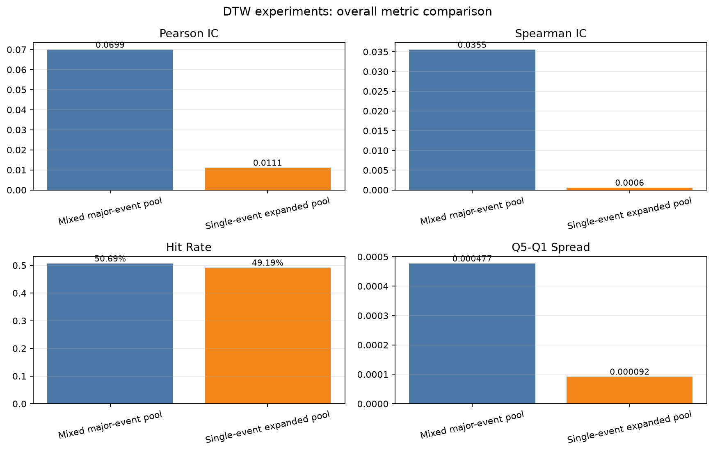
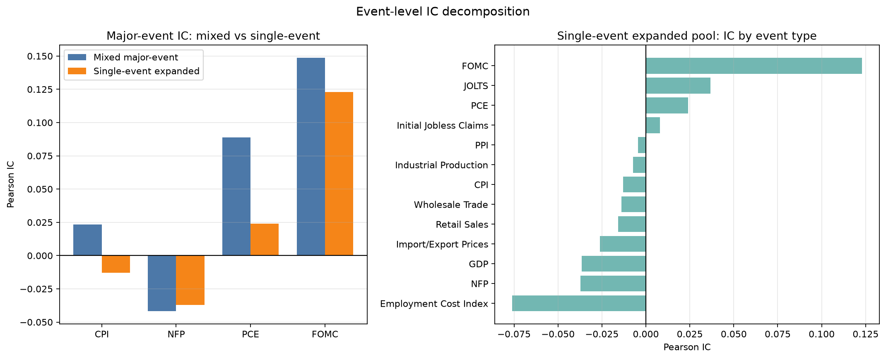
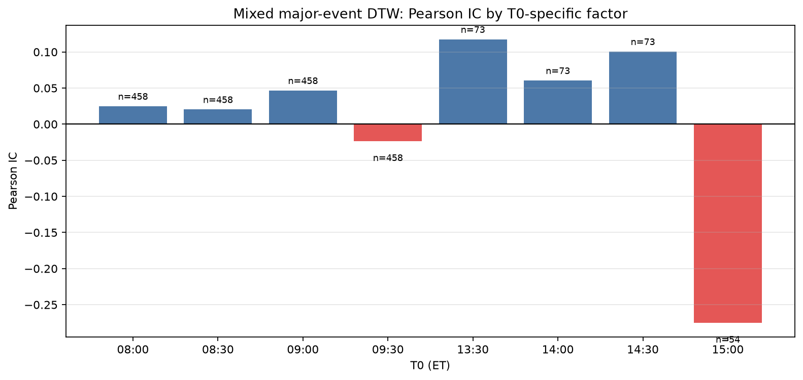
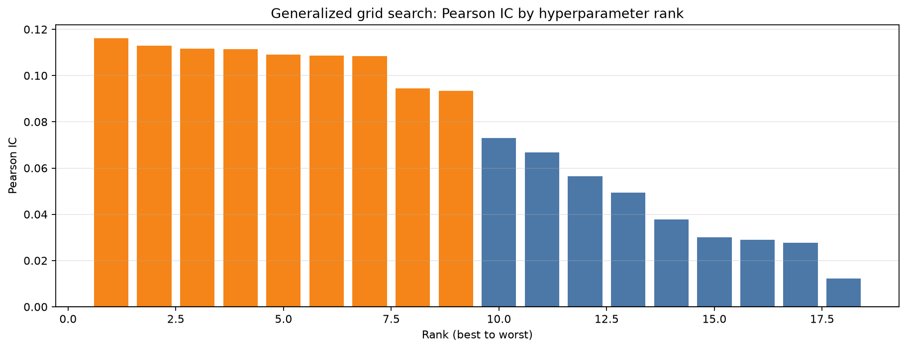
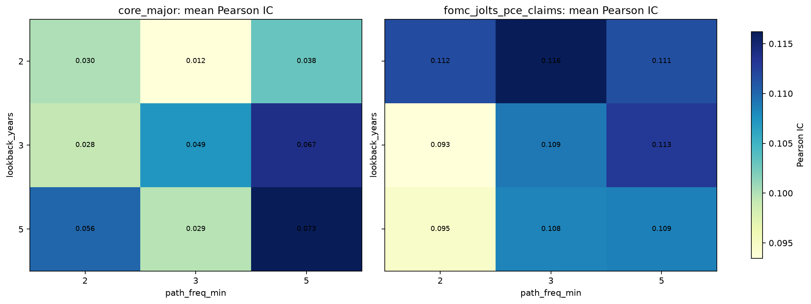
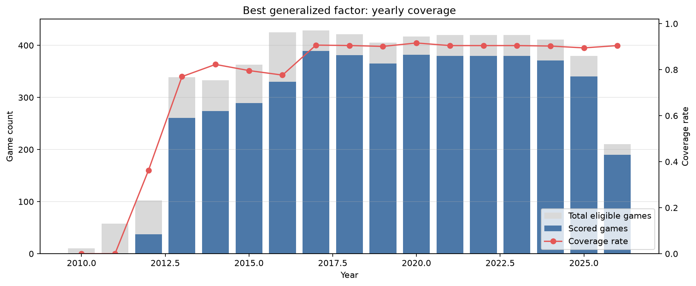
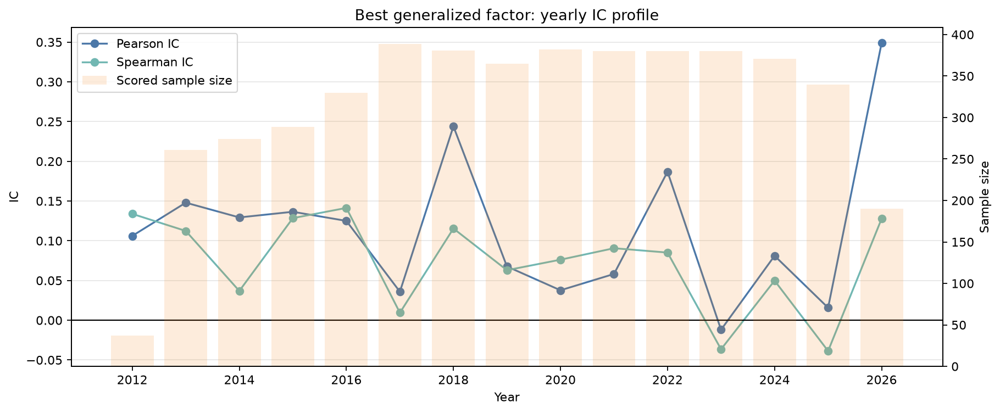

# hoshea_zeng

Every notebook here is paired with a companion `.py` file of the same name via [jupytext](https://jupytext.readthedocs.io/) (`py:percent` format, configured in the root `pyproject.toml`).

**The `.py` file is the source of truth.** Write and edit code there; the `.ipynb` is a synced, runnable view of it. See `CLAUDE.md` at the repo root for the exact workflow — that file governs how notebooks get created and updated in this project, so it isn't repeated here.

## Layout
Plain descriptive `snake_case` names, no numeric prefix — e.g. `data_exploration.py`, `dtw_baseline.py`. Name each notebook after what it does, not its position in a sequence.

- `data_cleaning.py` — writes the cleaned ES OHLCV parquet to `data/processed/` (raw -> processed).
- `macro_event_calendar.py` — a second, clearly-named cleaning notebook; writes the macro event calendar CSV to `data/processed/`. It builds an independent derived dataset (event timestamps, not price data), so it doesn't belong in `data_cleaning.py`.
- Every other notebook only reads from `data/processed/`; it never writes/derives data files itself. See `CLAUDE.md` for the full rule.

## DTW 30min game experiments

### Experiment A&B Design

Both experiments share the same statistical construction and differ only in the
historical matching pool. For an event timestamp $T$, define anchor times
$T_0 \in \{T-30, T, T+30, T+60\}$ minutes. The input series is a 60-minute path
from $T_0$ to $T_0+60$ (5-minute sampling, z-scored log returns). The prediction
target is the forward 30-minute return:
$$
y = \ln P(T_0+90) - \ln P(T_0+60).
$$

For each current game, DTW distance is computed under a Sakoe-Chiba constraint
(`dtaidistance`), nearest neighbors are selected, and the factor is formed as a
distance-and-recency weighted expected return:
$$
\text{dtw\_factor} = \sum_i w_i r_i,\quad
w_i \propto \frac{1}{d_i+\epsilon}\exp\!\left(-\frac{\text{age}_i}{\text{halflife}}\right).
$$

The only design difference is the neighbor pool:

- **Factor 1 (mixed major-event)**: event universe is `CPI/NFP/PCE/FOMC`, with
  cross-event matching allowed (same `clock_et` and `offset_min`).
- **Factor 2 (single-event expanded)**: event universe is the full expanded
  calendar, but matching is restricted to the same `event_type` (plus same
  `clock_et` and `offset_min`).

Hence, Factor 1 emphasizes sample depth and estimator stability, while Factor 2
emphasizes economic homogeneity. Both are evaluated by IC, hit-rate, and
quantile spread diagnostics.

### Shared setup (A/B experiments)

- **Price data**: `data/processed/es_1min_bars_2010_2026.parquet` (`close`, UTC 1-minute bars).
- **Event data**: `data/processed/macro_event_calendar_expanded_2010_2026.parquet`.
- **Game construction**:
  - For each event timestamp `T`, create anchors `T0 ∈ {T-30, T, T+30, T+60}` minutes.
  - DTW input path: `[T0, T0+60]`, sampled every 5 minutes, transformed to z-scored log returns.
  - Label return: `log P(T0+90) - log P(T0+60)` (a 30-minute forward "game").
- **DTW factor definition**:
  - Compute DTW distance with `dtaidistance` + Sakoe-Chiba window.
  - Select top-k nearest historical neighbors (no significance threshold in baseline).
  - Factor = distance-weighted + recency-weighted average of neighbors' future 30-minute returns.
- **Evaluation**:
  - Pearson IC, Spearman IC, sign hit-rate, quintile spread (Q5-Q1),
  - and per-event IC breakdown.

### Experiment A: Mixed major-event pool

- **Notebook**: `dtw_event_game_simple.py` / `dtw_event_game_simple.ipynb`
- **Research idea**:
  - Keep only major events (`CPI`, `NFP`, `PCE`, `FOMC`),
  - but allow matching across event types (mixed pool), conditioned on same `offset_min` and same ET clock.
- **Design parameters**:
  - `K_NEIGHBORS=15`, `LOOKBACK_YEARS=5`, `MIN_HISTORY=30`, `DTW_WINDOW_STEPS=3`.
- **Latest run summary**:
  - Event rows: `764` (CPI 216, NFP 208, PCE 205, FOMC 135).
  - Valid games: `2355`; scored games: `2105`.
  - Pearson IC: `0.0699`; Spearman IC: `0.0355`; hit-rate: `50.69%`; Q5-Q1: `0.000477`.
  - Per-event Pearson IC: CPI `0.0234`, FOMC `0.1486`, NFP `-0.0419`, PCE `0.0889`.
- **Conclusion**:
  - Mixed pooling gives a stronger aggregate IC in this run, but may blend heterogeneous event mechanisms.
  - Signal seems concentrated in FOMC/PCE; NFP remains weak/negative.

### Experiment B: Single-event pool on expanded calendar

- **Notebook**: `dtw_event_game_single_event_factors.py` / `dtw_event_game_single_event_factors.ipynb`
- **Research idea**:
  - Use all event types from expanded calendar,
  - and force matching strictly within the same event type (plus same `offset_min` and ET clock).
- **Design parameters**:
  - `K_NEIGHBORS=20`, `MIN_HISTORY=12`, `MAX_HISTORY_PER_GAME=250`, `DTW_WINDOW_STEPS=3`.
  - Smaller history threshold is used because per-event pools are thinner.
- **Latest run summary**:
  - Event rows: `3167` across `13` event types.
  - Valid games: `9926`; scored games: `9292`.
  - Pearson IC: `0.0111`; Spearman IC: `0.0006`; hit-rate: `49.19%`; Q5-Q1: `0.000092`.
  - Best per-event IC is still FOMC (`0.1229`), while most other event types are near zero.
- **Conclusion**:
  - Removing cross-event mixing improves economic purity but weakens aggregate predictive power in this baseline.
  - The result suggests event-specific structure exists (notably FOMC), but broad cross-event generalization is limited.

### Experiment C: Generalized mixed-event grid search

- **Notebook**: `dtw_event_game_simple_generalized.py` / `dtw_event_game_simple_generalized.ipynb`
- **Research idea**:
  - Keep mixed-event matching logic, but search a wider hyperparameter space and select by IC.
  - Extend game anchors with `offset=-60` and compare two event pools:
    - `["CPI", "NFP", "PCE", "FOMC"]`
    - `["FOMC", "JOLTS", "PCE", "Initial Jobless Claims"]`
- **Grid dimensions**:
  - `event_group`: 2 choices
  - `path_freq_min`: `[2, 3, 5]`
  - `lookback_years`: `[2, 3, 5]`
  - `dtw_window_steps`: frequency-adjusted from a fixed 15-minute warp tolerance
  - total combinations: `18` (with `tqdm` progress bar)
- **Important implementation notes**:
  - `offset` is **not** optimized as a standalone hyperparameter in this version;
    offsets are fixed at `[-60, -30, 0, 30, 60]` during sample construction.
  - Reported IC is computed on the pooled scored sample across all included offsets.
  - Therefore, `best_factor` naturally contains multiple offsets.
- **Best combination (latest run)**:
  - `event_group`: `fomc_jolts_pce_claims`
  - `path_freq_min`: `3`
  - `dtw_window_steps`: `5`
  - `lookback_years`: `2`
  - `total_games`: `5563`, `scored_games`: `4749`
  - Pearson IC: `0.1162`, Spearman IC: `0.0700`, hit-rate: `51.51%`, Q5-Q1: `0.000315`
- **Saved outputs**:
  - `outputs/dtw_simple_generalized_grid_results.parquet` (all 18 combinations)
  - `outputs/dtw_simple_generalized_best_params.json` (best row metadata)
  - `outputs/dtw_simple_generalized_best_factor.parquet` (scored panel under best combo)
- **Conclusion**:
  - The generalized search improves aggregate IC materially versus A/B baselines,
    largely by favoring the `FOMC+JOLTS+PCE+Claims` pool with shorter lookback.
  - The signal is still weak in pure direction terms (hit-rate near 0.5), so it is
    better treated as a ranking/probability feature than a standalone directional rule.

### Generalized experiment Q&A (English talking points)

These short paragraphs are intended for discussion slides or verbal explanation.

1) **What hyperparameters were searched, and what improved performance?**

> "We ran an 18-point grid over event-group definition (2 choices), resampling frequency (2/3/5 minutes), and historical lookback (2/3/5 years), with DTW window size adjusted by frequency from a fixed 15-minute warp tolerance.  
> The strongest improvement came from event-group choice: the `FOMC+JOLTS+PCE+Initial Jobless Claims` pool dominated the `CPI+NFP+PCE+FOMC` pool (mean Pearson IC 0.107 vs 0.042).  
> The best individual setting was: group=`fomc_jolts_pce_claims`, frequency=3 minutes, lookback=2 years, DTW window steps=5, with Pearson IC 0.116."

2) **From which year does the best-factor panel start, what is coverage, and how is IC?**

> "Under the best hyperparameter setting, scored observations start in 2012.  
> Overall coverage is 4,749 scored games out of 5,563 eligible games (85.4%). Coverage is intentionally low in the warm-up years (2010-2012) because the method requires enough historical neighbors, and stabilizes around 90% from 2017 onward.  
> Aggregate performance is Pearson IC 0.116 and Spearman IC 0.070, with a hit rate around 51.5%."

3) **How is z-score used in DTW similarity, and why?**

> "For each candidate input path, we compute log returns and z-score them within the path window before DTW. This normalization removes level and scale effects, so DTW compares shape rather than absolute price or volatility magnitude.  
> In other words, z-scoring makes path matching more regime-robust and prevents high-volatility intervals from dominating the distance metric mechanically."

4) **How can we increase dtw_factor coverage for more tradable time windows?**

> "Coverage can be raised through hierarchical matching and adaptive constraints:  
> (i) lower or event-adapt `MIN_HISTORY` and `K`;  
> (ii) use fallback pools (same event -> same event-group -> broader macro pool) when strict pools are sparse;  
> (iii) optimize offset subsets as explicit hyperparameters rather than treating all offsets equally;  
> (iv) add a confidence gate that trades only when DTW signal strength is high, while allowing broader signal computation for monitoring.  
> This preserves quality control while expanding the fraction of timestamps where a signal is available."

### Practical takeaway and next steps

- DTW-as-factor is currently **promising but not robust** across all event buckets.
- Next high-priority upgrades:
  - add significance gating / permutation null threshold before neighbor selection;
  - compare against simple momentum baseline on identical games;
  - add rolling monthly retrain and out-of-sample tracking by event type;
  - report uncertainty bands (e.g., bootstrap IC confidence intervals).

### Visual result dashboard

The following figures summarize the latest baseline outputs and help identify
where the signal is strongest/weakest:

1. **Overall metric comparison** (mixed major-event vs single-event expanded):



2. **Event-level IC decomposition**:



3. **T0-specific factor IC decomposition** (for mixed major-event setup):



4. **Generalized grid-search IC ranking** (Experiment C):



5. **Generalized grid heatmap** (mean IC by frequency/lookback, by event group):



6. **Best generalized factor yearly coverage**:



7. **Best generalized factor yearly IC profile**:



To regenerate all figures and descriptive summary CSVs:

```bash
uv run python hoshea_zeng/generate_dtw_readme_figures.py
```